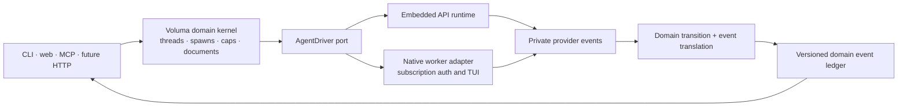
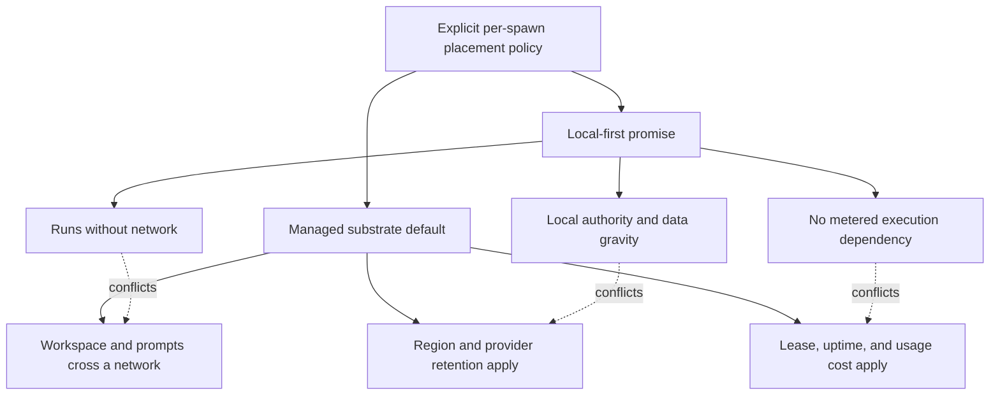

# Architect review: runtime, substrate, and future surfaces

**Verdict:** keep Voluma's domain authority, but narrow what that means. The
daemon should own threads, spawns, capabilities, durable domain events, and
collaborative documents. It should not also promise to own every provider's
agent loop. Run API-backed agents behind a replaceable runtime port and treat
subscription-auth harnesses as external workers. Keep remote sandboxes as an
explicit execution placement, not the cross-platform definition of the product.

Two current framings need correction before they become contracts:

1. `HarnessEvent` is presently both an adapter envelope and a candidate public
   event model. Those change at different rates. Provider events must remain
   private ingress; versioned domain events should feed queries, webhooks, and
   remote protocols.
2. “Substrate-first” conflicts with “local-first” when substrate means a managed
   remote microVM. The conflict disappears only when local, self-hosted, and
   managed-remote placement are explicit policies with different sovereignty,
   latency, and cost properties.

The review is against the proposed two-axis decision in
[Harness-Agnostic Foundation, “The core reframe”](../../codebase-audit-rewrite/design/harness-agnostic-foundation.md#the-core-reframe-two-orthogonal-axes),
the target state in [Voluma v1 Architecture](../v1-architecture.md), and the
still-proposed [Surface Architecture Notes](../surface-architecture-notes.md).

## 1. Own the domain kernel, not every agent runtime

The hidden third option is **asymmetric execution**: an owned Voluma domain
kernel, a replaceable runtime for API-backed agents, and coordination adapters
for native subscription-auth harnesses. Architecture need not be uniform across
auth boundaries.

| Option | What it buys | What it costs | When it wins |
|---|---|---|---|
| Own canonical model and all execution semantics | Maximum control; one debugger and policy vocabulary | Voluma must implement provider streaming, tool loops, retries, compaction, steering, handoffs, guardrails, and every provider quirk | Only two simple harness classes; execution behavior is a product differentiator |
| Adopt or fork one runtime for all agents | Mature loop, provider adapters, extension ecosystem, fewer local semantics | Runtime model leaks upward; subscription auth/TUI regressions remain; fork and upstream churn become permanent | One runtime covers auth, tools, sessions, and providers without losing native product behavior |
| **Owned domain kernel + embedded runtime port + native worker adapters** | Stable Voluma authority without rebuilding mature API loops; native auth remains intact | Two execution paths need conformance tests; some features will remain path-specific | API agents grow while Claude/Codex native paths remain commercially important |
| Protocol-only coordinator; harnesses own sessions and history | Smallest Voluma runtime | Weak replay, policy, cross-harness query, and CRDT integration; provider availability becomes state availability | Voluma becomes only a launcher, not a collaborative agent product |

### Adversarial finding

The original decision correctly rejects a Pi fork as the whole product
([Foundation, “Axis 2 decision”](../../codebase-audit-rewrite/design/harness-agnostic-foundation.md#axis-2-decision-stay-the-coordinator-own-the-canonical-model)).
It does not follow that Voluma should implement a unified agent runtime itself.
The v1 “unified API harness” already owns model invocation, tool execution, and
response lifecycle
([v1 §5.3](../v1-architecture.md#53-unified-api-harness-path)). Once it also
needs provider negotiation, multi-step stopping, retries, compaction, handoffs,
parallel tools, approval suspension, and resumable streams, it **is** a runtime
under a different name.

The earlier contracts do not force that outcome. The bundle design makes one
harness the extension unit but explicitly leaves `HarnessConnection` and
`HarnessEvent` unchanged
([Bundle Contract §6–7](../../codebase-audit-rewrite/design/bundle-contract.md#6-harness-contract-evolution)).
The SDK design then maps in-process SDK streams into that same envelope
([SDK Connections §1](../../codebase-audit-rewrite/design/sdk-connections.md#1-architecture)).
This is useful migration containment, but it is not a reason to let the
connection own agent-loop semantics forever. Moving registration up one level
to an `AgentDriver` preserves the one-extension-unit property at the cost of a
new conformance boundary.

That becomes more expensive than adopting a runtime when all three are true:

- API-backed agents are a majority of runs or product investment.
- Voluma needs three or more advanced loop behaviors across two or more
  providers.
- Provider/runtime maintenance consumes more capacity than the Voluma-specific
  capabilities it enables (CRDT writes, capabilities, collaboration, and
  durable coordination).

The alternative is not free: a runtime library brings its own messages,
sessions, and event vocabulary. The containment move is to depend on it only
behind an `AgentDriver`, never make its session object or stream events the
database authority. The [Pi prior-art analysis](../prior-art-pi.md#patterns-to-steal)
already identifies the reusable loop and provider seams; its JSONL authority and
single-agent process model remain unsuitable.

Auth reinforces the asymmetric boundary: the SDK contract already treats a
transport change as a possible billing-path change and refuses to default it
until subscription preservation is verified
([SDK Connections §8](../../codebase-audit-rewrite/design/sdk-connections.md#8-auth-and-billing-preservation)).
Forcing uniform execution is therefore not merely an implementation cleanup;
its alternative cost can be a user-visible change in authentication and spend.

The more immediate contract problem is `HarnessEvent`. In v1 it contains an
open `eventType` and `payload: unknown`
([v1 §5.3](../v1-architecture.md#53-unified-api-harness-path)), while the durable
event table and `EventSink` use another open event shape
([v1 §6.8](../v1-architecture.md#68-events-and-observability),
[§9.1](../v1-architecture.md#91-events)). If public queries or webhooks expose
either directly, provider churn becomes a compatibility obligation. Keeping the
event opaque is cheaper now but pushes branching into every future consumer.



### Recommendation and flip condition

**Adopt the asymmetric option now.** Define a small `AgentDriver` around run,
inject, interrupt, stop, and event ingress. Let a TS runtime library implement
the API driver; keep Claude Code and any other subscription-bound product as
native worker drivers. Voluma sessions are durable domain records; runtime
session/thread IDs are opaque continuation references. `HarnessEvent` stays
internal and lossless, while named, versioned domain events represent accepted
state transitions.

Do not fork Pi now. **Flip to owning/forking a runtime** only if a required
behavior cannot be expressed through the driver without leaking runtime state
into Voluma's domain model, and that behavior accounts for at least two core
product features. **Flip toward a runtime as the default API driver** when any
two of these occur: three provider adapters, three advanced loop behaviors,
API-backed agents exceed roughly 70% of runs, or two consecutive milestones
spend over 30% of harness effort on loop/provider parity. These are review
triggers, not automatic migration rules.

## 2. Remote substrate is a deployment mode, not local-first infrastructure

The local-first promise and remote execution are compatible only when the user
chooses which work crosses the boundary. Making a managed sandbox the default
quietly changes Voluma from local software into a network service.

| Option | What it buys | What it costs | When it wins |
|---|---|---|---|
| Local process + OS containment | Offline operation, workstation data gravity, no per-run infrastructure bill | Platform-specific containment; Windows/macOS strict modes are uneven | Developer laptops; sensitive research; interactive, low-latency work |
| Managed remote sandbox first | Uniform Linux boundary, strong isolation, browser-friendly execution, elastic concurrency | Network and startup latency; workspace transfer; account/region dependency; metered compute/storage; lease and secret plumbing | Hosted SaaS, burst workloads, untrusted code where managed isolation outranks locality |
| Self-hosted/org substrate | Linux uniformity inside the researcher's trust domain | Org operations, capacity planning, upgrades, and support matrix | Regulated labs and enterprises with infrastructure teams |
| **Placement policy: local default, remote explicit** | Preserves local-first while making strict remote execution available | More modes to test and explain; runs are not behaviorally identical | A product serving both individual researchers and managed organizations |

### Adversarial finding

The documents currently promise both that “nothing leaves the machine” without
explicit sync ([v1 §12.1](../v1-architecture.md#121-sync-scope)) and that a
substrate is the long-term OS-agnostic answer
([Foundation, “Axis 1 decision”](../../codebase-audit-rewrite/design/harness-agnostic-foundation.md#axis-1-decision-substrate-is-the-by-construction-answer-fix-local-host-first)).
Those statements describe different products unless execution placement is
also treated as data export.

For a remote sandbox, prompts, selected repository content, tool inputs,
command output, and often credentials cross the machine boundary even when the
Yjs sync switch is off. Calling only database replication “sync” understates
the sovereignty boundary. Avoiding remote transfer preserves sovereignty but
forfeits the remote sandbox's ability to operate on the workspace.

Vercel Sandbox sharpens rather than resolves the tension. Its official material
describes usage-based CPU/memory pricing and persistent filesystem snapshots;
Vercel also documents a current single-region `iad1`/US-East footprint. That is
a reasonable elastic execution product, but it makes region, billing, account
availability, and snapshot retention product properties, not adapter details.
([Vercel Sandbox docs](https://vercel.com/docs/sandbox),
[Vercel persistence guide](https://vercel.com/kb/guide/vercel-sandbox-duration-and-persistence),
[Vercel comparison guide](https://vercel.com/kb/guide/vercel-sandbox-vs-codesandbox))

The tension is structural:



Remote placement also changes performance. The `<100ms` spawn-creation target
ends before process start ([v1 §11](../v1-architecture.md#11-performance)), so
it does not bound sandbox allocation, repository hydration, or artifact return.
Keeping that target is cheap but can hide the latency users feel; measuring
time-to-first-agent-event and time-to-workspace-ready costs more instrumentation
but compares placements honestly.

### Recommendation and flip condition

**Replace substrate-first with placement-first.** Give every spawn an explicit
`execution_placement` resolved from policy: `local_process`,
`local_isolate`, `org_sandbox`, or `managed_sandbox`. Default to local for the
local product and org sandbox for hosted deployments. Before launch, produce a
machine-readable egress manifest: files/mounts, prompt classes, secret grants,
region, persistence/retention, and estimated billing class. A remote run is an
explicit export grant even when collaboration sync is disabled.

Keep a substrate adapter contract and verify at least one self-hosted path
alongside any managed provider. **Flip a deployment's default to remote** when
its administrator owns the substrate trust domain, or when the user explicitly
chooses stronger remote isolation after seeing the egress contract. Do not flip
the local product globally on adoption or latency metrics alone. Reconsider
Vercel as the research default only after required regions/data-processing
terms exist and a representative repository meets declared p95
workspace-ready and cost budgets.

## 3. Collapse authority ownership before adding WASM

Three source languages plus a WASM target are manageable only when they meet at
process or wire contracts. They are dangerous when the same policy is
represented in more than one of them. The current documents disagree about
ownership before WASM is even added:
the foundation keeps a Python-first coordinator, the converged local-first doc
shrinks Python to a Claude bridge, and v1 replaces the three systems with one TS
authority process
([Foundation §Axis 2](../../codebase-audit-rewrite/design/harness-agnostic-foundation.md#axis-2-decision-stay-the-coordinator-own-the-canonical-model),
[Local-First, “The core split”](../../codebase-audit-rewrite/design/local-first-architecture.md#the-core-split-d18--users-claude-code-refinement),
[v1 §1](../v1-architecture.md#1-executive-summary)).

Strictly, WASM is not a fourth source language; it is a second distribution and
execution target for Rust. It still creates a fourth ownership surface—ABI,
host imports, generated bindings, packaging, and runtime-specific failures—so
counting only source languages understates rather than removes the seam.

| Option | What it buys | What it costs | When it wins |
|---|---|---|---|
| Python coordinator + TS daemon + Rust CLI + WASM core | Reuses existing code and gives both hosts in-process resolution | Duplicate authority and models; four release toolchains; WASM ABI, packaging, filesystem, and error-translation work | Python and TS remain peer authorities and both require latency-sensitive live resolution |
| Rewrite package resolution/config in TS | One main runtime/toolchain | Semantic drift from mars; migration and fixture burden; two resolution implementations survive | mars is retired or its package semantics deliberately move into Voluma |
| **TS authority + Rust mars compiler subprocess; Python as a thin client/legacy product** | One runtime authority; stable JSON/filesystem boundary; Rust owns resolution once | Subprocess startup and artifact invalidation; no in-process live resolver | Resolution is batch or per-spawn latency is acceptable/cached |
| Pure Rust `mars-core`, distributed as WASM to TS/Python | One algorithm in multiple hosts; low call overhead after load | Requires a pure core, host capability ABI, dual package releases, WASM debugging and conformance | Two durable non-Rust hosts need the same live resolver in-process |

### Adversarial finding

The language count is not itself the defect. The ownership seams are:

```text
Voluma v1
├── TypeScript authority
│   ├── domain records, lifecycle, capabilities, Yjs
│   └── parses launch-bundle and catalog schemas
├── Python bridge or 0.x coordinator
│   ├── risk: repeats lifecycle/event/config semantics
│   └── acceptable target: RPC/stdio translation and native process custody only
└── Rust mars compiler
    ├── owns package resolution, precedence, lowering, lock identity
    └── emits versioned catalog + launch-bundle artifacts
```

The [Surface Notes, “SDK question”](../surface-architecture-notes.md#sdk-question--split-in-two)
defer `mars-core` extraction until a live-resolution consumer appears, then
assume WASM for both TS and Python. Waiting to compile to WASM is sound; waiting
to separate pure resolution from CLI I/O is a rewrite trap. If mars accumulates
filesystem access, process environment, terminal output, and mutation inside
the resolver, later extraction will be an architectural refactor under a
shipping server dependency. Extracting a pure Rust library now costs some
internal restructuring, but it is useful even if no WASM artifact is ever
published.

Conversely, publishing WASM now would add a boundary without a consumer. The
current subprocess contract already has an explicit v3 launch bundle and hard
failure semantics ([v1 §10.1–10.3](../v1-architecture.md#101-integration-contract)).
Batch compilation at `mars sync`, plus cache invalidation on compiler version,
config digest, and lock digest, may eliminate the supposed need for live
resolution. It costs freshness bookkeeping; WASM costs a permanent ABI and
release matrix.

### Recommendation and flip condition

**Settle one authority: TypeScript v1.** Python may remain a separately shipped
0.x product or a thin native-launch/RPC client, but it must not own canonical
sessions, events, capability resolution, or config precedence for v1. Keep mars
as a Rust compiler process. Publish JSON Schemas plus golden cross-language
fixtures for the resolved catalog, launch bundle, errors, and provenance; require
explicit schema negotiation rather than duplicating TypeScript interfaces by
hand.

Inside mars, separate a deterministic `mars-core` crate from filesystem/CLI
adapters now, but do not promise WASM distribution. **Flip to WASM** only when
at least two durable non-Rust hosts require live, in-process resolution and the
measured cached subprocess/artifact path misses a declared latency budget. If
only the TS daemon needs it, first compare a long-lived mars service or
incremental compiler process; that costs lifecycle management but avoids a
Python WASM distribution that the target architecture should not need.

## 4. Shape contracts for a query/event API; project MCP, webhooks, and A2A from it

The next foundational surface is not an SDK and not A2A. It is an authenticated,
cursor-based **resource query and domain-event API**. Remote MCP, webhook push,
and A2A are projections over that base.

| Option | What it buys | What it costs | When it wins |
|---|---|---|---|
| More stdio MCP tools only | Fastest harness reach; matches current worker integrations | Local/process binding; uneven notifications; weak fit for humans and generic automation | Managed local agents are the only consumers |
| Remote MCP via Streamable HTTP | Remote agent access without a new tool vocabulary | MCP session/auth/transport support varies; tool calls are not a durable resource API | External agent clients need ad hoc interactive access |
| **Public query + event API** | Common base for webapp, automation, generated clients, replay, webhooks, and protocol adapters | Versioning, auth, pagination, redaction, quotas, and compatibility become product work | More than one non-process consumer exists—which v1 already has |
| Signed webhook/event push | Disconnected automation and completion delivery | Outbox, retries, signing, dedupe, SSRF defense, endpoint lifecycle | CI, lab pipelines, and long-running jobs need push |
| A2A remote edge | Agent discovery, task lifecycle, streaming, artifacts, cross-vendor federation | Semantic projection, delegated identity, protocol evolution, and public attack surface | Independent organizations or agent platforms delegate work to Voluma |

### Adversarial finding

The two-MCP split is a good **privilege** boundary: per-spawn mutation is tied
to a capability-bearing channel, while shared query is long-lived
([Surface Notes, “Two MCP modules”](../surface-architecture-notes.md#two-mcp-modules-split-by-privilege-and-binding--not-topic)).
It is not yet an adequate remote trust boundary. “None beyond read access” is
unsafe once transcripts, work context, paths, agent definitions, or cost data
are reachable beyond localhost. Avoiding auth is cheaper only while the query
module is strictly local; remote use must bind project/tenant scopes and field
redaction to identity.

MCP notifications should remain an optimization, as the notes propose. The
official Streamable HTTP transport permits server notifications and resumable
SSE but does not require every server/client to support a listening stream;
disconnect also does not cancel a request. Durable cursors and explicit cancel
must therefore live below MCP.
([MCP transport specification](https://modelcontextprotocol.io/specification/2025-06-18/basic/transports))

A2A is the natural **federation edge**, not the internal model. Its task,
message, artifact, streaming, subscription, and push-notification concepts map
well to long-running Voluma work, but an A2A task does not capture capability
lattices, CRDT authority, or Voluma's thread/spawn distinction. Adopting it as
canonical would save adapter code and cost domain fidelity. Adapting at the
edge preserves both at the cost of an explicit projection. The current A2A
specification also defines push notification delivery as at-least-once with
optional retry behavior, so Voluma still needs idempotent event IDs and an
outbox if it promises reliable automation.
([A2A specification](https://a2a-protocol.org/latest/specification))

### Recommendation and flip condition

Define the internal/public contract around resources and accepted domain events
now:

- stable IDs for project, session, thread, spawn, turn, artifact, and document;
- monotonic per-project event sequence plus opaque resumable cursor;
- event `type`, `version`, `occurred_at`, `actor`, `subject`, `trace`, and typed
  `data`; raw harness payload is privileged diagnostic data, not a public field;
- idempotency key and expected-version precondition on remote mutations;
- tenant/project scope and redaction policy on every query;
- snapshot query followed by events-after-cursor, so consumers close the race
  between list and subscribe.

The CLI and both MCP modules remain thin adapters over the same operations, as
already committed in the Surface Notes. Add an outbox transaction beside the
event ledger even before webhook delivery exists. A future webhook adapter can
use a CloudEvents-compatible envelope without making CloudEvents the domain
model; this costs a projection but gains existing routing/tooling conventions.
([CloudEvents](https://cloudevents.io/))

**Flip the next exposed surface to remote MCP** if a named external harness is
blocked on tool access before a general API is ready. **Expose A2A** when a
second administrative domain needs task delegation or discovery, not merely
because a local subagent exists. **Publish an SDK** only after two consumers
repeat authentication, pagination, cursor, or error-handling code; generate it
from the API/schema rather than hand-maintaining another source of truth.

## Directions to consider now

Ranked by leverage, these are the future paths whose cheap enabling work belongs
in v1.

| Rank | Future path | Why it has leverage | Cheap thing to do today |
|---:|---|---|---|
| 1 | **Versioned domain event and query contract** | Prevents provider events, DB rows, MCP results, and public integrations from becoming one accidental API | Split private `HarnessEvent` from typed domain events; add event version, actor/subject, cursor, and golden serialization fixtures |
| 2 | **Hybrid execution placement with sovereignty policy** | Preserves the product's local-first claim while keeping managed isolation and hosted scale available | Add `execution_placement` and an egress-manifest type to launch input; record actual placement/provider/region on each spawn |
| 3 | **Replaceable API runtime driver** | Avoids rebuilding provider loops without ceding Voluma's collaborative domain model | Define `AgentDriver` conformance cases for run/inject/cancel/resume/tool approval and test one runtime plus one native worker against them |
| 4 | **Pure mars compiler core, distribution undecided** | Keeps precedence single-sourced and makes future WASM/service choices reversible | Refactor deterministic resolution behind a Rust crate; publish JSON Schemas and fixtures; fingerprint compiler/config/lock in artifacts |
| 5 | **A2A + reliable webhook projection** | Opens federation, CI, and disconnected long-running work without distorting the core | Reserve artifact IDs and event cursors; maintain an event outbox; document the future mapping from Voluma spawn/turn/artifact to A2A task/status/artifact |

These moves preserve the strongest existing decisions—one authority process,
thin surfaces over shared operations, mars as compiler, and explicit native
auth exceptions—while preventing execution technology or transport protocols
from becoming the product's irreversible center.
