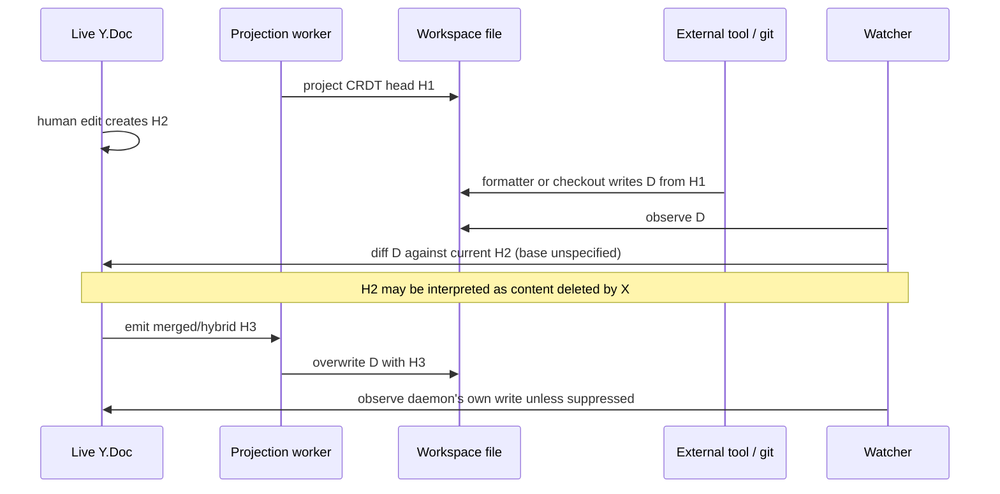

# Architect review: CRDT write seam and data-model correctness

**Verdict: redesign the authority boundary before build.** One daemon-owned Yjs
document per tracked file is a credible collaboration kernel. The proposed
product seam is not yet a credible authority protocol. It specifies three ways
to call a method, but not the ordering, idempotency, projection, namespace, or
multi-document commit rules that make those calls equivalent. The schema then
removes fields and constraints required by the inherited journal/reversal
contract while duplicating execution state across sessions, threads, and
spawns.

The highest-risk gap is not whether Yjs converges. It does. The gap is that
state-dependent agent commands, ordinary files, and relational side effects are
outside the CRDT algebra. “Yjs is authoritative while active; disk is
authoritative while inactive” is two authorities separated by an undefined
state transition, not one authority.

This review is against [v1 architecture §4](../v1-architecture.md#4-crdt-write-seam),
[§6](../v1-architecture.md#6-data-model),
[§7](../v1-architecture.md#7-capability-and-security), and
[§8](../v1-architecture.md#8-thread-model), with the prior
[write-seam design](../../codebase-audit-rewrite/design/crdt-write-seam.md), the
[deep data-model analysis](../../codebase-audit-rewrite/design/data-model-analysis.md),
and the [current collab invariants](../invariants-flow-collab.md) as checks on
what the fork actually needs to preserve.

## Review invariants

| ID | Invariant the foundation needs |
|---|---|
| W1 | A workspace path resolves to one stable document identity and one serialized mutation authority. |
| W2 | The same authenticated request through MCP, CLI, or in-process binding commits once with the same attribution and outcome, or receives the same deterministic rejection. |
| W3 | Command evaluation has a defined linearization point. Binding latency cannot silently change a command from one valid edit into a different valid edit. |
| W4 | A successful write distinguishes durable CRDT commit from successful filesystem projection; neither side silently overwrites changes the other side has not observed. |
| W5 | “Undo a turn” preserves concurrent non-target edits and is either atomic across its document set or explicitly a partial, resumable revert. |
| W6 | Document content and workspace namespace operations—create, rename, delete, mode, symlink—have one conflict policy. |
| D1 | Rows cannot represent an impossible project/session/thread/spawn/document relationship. |
| D2 | SQLite and Postgres provide the same domain transaction, even where their physical schemas and concurrency controls differ. |

## A. Write-seam findings

### WS-1 — Blocker: CRDT convergence is being mistaken for command equivalence

`replace`, `insert`, and `create(overwrite)` are read-modify-write commands. They
are evaluated against a particular visible document, so they do not commute
merely because the Yjs updates produced afterward commute. Section 4.3 puts CLI
requests behind HTTP, while §4.4 lets embedded agents enter in-process. The
design names no request sequence, expected state vector, generation, or
linearization point.

**Concrete race.** At head `H`, remote agent A issues `replace(find="x",
content="a")`; its request stalls in a sandbox network. Embedded agent B issues
`insert(after="x", content="b")` and reaches `WriteService` first. When A
arrives, it may match a different `x`, match more instances, or fail. A per-doc
mutex makes each execution safe but makes transport latency choose semantics.
If A instead planned its Yjs update at `H` and delivered it later, low-level
merge would converge, but that is not the API described in §4.5.

**Violated:** W2, W3.

**Required change.** Define a canonical `WriteEnvelope` with a mandatory
idempotency key and planning base (`documentGeneration` plus Yjs state vector or
head sequence). All bindings enter the same scheduler, including in-process
calls. A state-dependent command whose base is stale must follow one named
policy: reject with current head, deterministically re-plan and report that fact,
or write to an isolated branch. Do not call arrival-order execution “identical
CRDT semantics.”

### WS-2 — Blocker: retries can duplicate edits, and attribution differs by binding

The CLI distinguishes daemon/connectivity errors with exit code 2 (§4.3), but
there is no protocol for “request committed and response was lost.” Retrying an
`insert` or `create(overwrite=true)` can commit twice. `tool_use_id` is optional,
appears both in the model command and host context, and the proposed mutation
schema uses `write_id` for the model-facing `w<N>` handle (§§4.5, 6.7). The
current agent-edit contract instead distinguishes a durable attempt/idempotency
ID from the per-document/thread `w<N>` ordinal; the v1 schema collapses them.

Attribution is also not transport-neutral. The CLI reads `VOLUMA_TURN_ID` from
its environment (§4.3). A daemon cannot update the environment of an already
running Claude process between turns; descendants see the launch-time value.
MCP and embedded runtimes can know the current tool call directly, while a bash
subprocess cannot unless it queries a daemon-owned turn lease or receives a
per-call token. An omitted/stale turn ID makes turn reversal and provenance
binding-specific.

Finally, `HostWriteInput` accepts caller-authored `actor`, `cwd`, and context
(§4.1), although §7.1 says stored capability is authoritative. A bearer token
must resolve the principal, project, workspace, cwd root, thread, and allowed
turn server-side; caller fields may narrow or correlate, never select another
identity.

**Concrete failure.** The daemon commits CLI request R, the sandbox loses the
HTTP response, and the model retries. The first call is journaled under a stale
turn from process launch; the second has no stable request ID and creates `w2`.
MCP would have committed once under the live turn. Both used the same
`WriteCommandSchema`, but not the same semantics.

**Violated:** W2, W5, D1.

**Required change.** Persist `write_attempt_id` with a unique scope before
execution and return the stored outcome on retry. Keep it separate from
`write_ordinal`/`w<N>`. Mint short-lived per-turn invocation credentials or have
the CLI resolve its live context from its spawn credential on each call. Make
the daemon construct `RequestContext`; remove caller-selected authority from
`HostWriteInput`.

### WS-3 — Blocker: the filesystem reconciler has no safe base or feedback-loop protocol

Section 4.7 says an active Y.Doc imports a disk change as a concurrent update;
the prior seam says the watcher simply “updates the Y.Doc.” Neither specifies
the base from which the disk writer edited, how a whole-file save becomes
identity-preserving Yjs operations, or how daemon projections are suppressed
when the watcher sees them. `disk_hash` and `last_projected_at` in §6.6 record
one observed result; they do not identify the causal generation of an event.



This is especially destructive for `git checkout`: treating a branch switch as
character edits merges unrelated branch contents into the old Y.Doc, after
which outbound projection can overwrite the checked-out branch with a hybrid.
A formatter has a similar three-state race: last projected base `B`, current
CRDT `C`, and formatter result `D`. Diffing only `C` and `D` cannot recover the
formatter's intent.

The active/inactive switch is also undefined. Is “active” an in-memory Y.Doc, a
WebSocket client, a running agent, or an uncheckpointed journal? A watcher event
can be queued while the last client disconnects, so a boolean classification at
handler time can choose the opposite authority from classification at event
time.

**Violated:** W1, W4.

**Required change.** Make projection a versioned replica protocol. Persist an
export generation and exact base hash/snapshot; write through temp + fsync +
atomic replace while preserving mode; register the expected resulting hash
before rename; ignore only a watcher event matching that generation. Import an
external save as `B -> D` against retained base `B`, then map that patch onto
`C`. Checkout, rename, delete, symlink, encoding, and mode changes are namespace
transactions, not text changes, and must freeze/rebase/reject rather than enter
the text CRDT blindly.

### WS-4 — Blocker: document identity collapses all worktrees into one file

The product explicitly lets work items and spawns select different workspaces
(§§6.4–6.5), but documents are unique on `(project_id, relative_path)` and also
store one `absolute_path` (§6.6). Two agents editing `src/main.ts` in separate
git worktrees therefore resolve to the same Y.Doc, even though the files have
different bases and are intentionally isolated. Conversely, renaming the file
changes its unique key and tends to create a new document, losing stable
history.

**Concrete failure.** Spawn p7 works on `/repo.worktrees/auth/src/main.ts` while
p8 works on `/repo.worktrees/cache/src/main.ts`. Both commands resolve the same
document row. Their content merges in Yjs; projection has only one
`absolute_path`, so one worktree receives both branches or the later path wins.

**Violated:** W1, W6, D1.

**Required change.** Introduce a durable `workspace`/`checkout` identity. Key a
tracked projection by `(workspace_id, canonical_relative_path)` and keep host
absolute paths in a local mount table, not portable document identity. Decide
separately whether two workspaces intentionally share a CRDT branch.

### WS-5 — High: multi-file response commit is promised by shape, not specified as a transaction

Every `WriteCommand` names one file (§4.5), but a response/turn commonly edits
many files and `WriteService` exposes `commitResponse`/`rollbackResponse` (§4.1).
The architecture does not state whether these calls atomically append all
document updates, when live Y.Docs become visible, how per-document mutexes are
ordered, or what happens when projection of file 2 fails after file 1 succeeds.
The current package has an `appendBatch` port and staged response machinery;
those are load-bearing guarantees, not implementation trivia. The v1 sequence
diagram shows one Y.Doc and one refresh and never adopts a multi-document
commit contract.

Turn reversal is explicitly non-atomic in the current server: documents are
reversed sequentially and the aggregate can be `partial`
([collab invariants §§1 and 3](../invariants-flow-collab.md#reversalstore)). That
behavior may be acceptable, but the product must not label it “undo the agent's
turn” without a resumable operation record and per-document result.

**Concrete failure.** A response stages changes to A and B. Commit persists A,
then B hits a stale generation. A human immediately builds the half-committed
workspace. Rollback reverses A, but a concurrent human edit now depends on A and
the engine correctly refuses reversal. The response remains neither committed
nor rolled back.

**Violated:** W2, W5.

**Required change.** Add a durable `change_set` aggregate with requested,
committing, committed, projection_pending, rejected, and partially_reverted
states. Lock document IDs in a stable order; validate every base before append;
append updates, mutation rows, and the domain event in one DB transaction. Make
live visibility/recovery explicit. If cross-document atomic visibility is not a
v1 requirement, remove the implication and expose per-file commits plus a
first-class partial result.

### WS-6 — High: “undo” is selective reversal with dependency refusal, not restoration of a turn

Yjs supports origin-scoped selective undo, but even its `UndoManager` requires
tracked origins and explicit capture boundaries. The inherited implementation
is stronger than a naive undo manager: it reconstructs from the journal,
computes dependency closure, and rejects when later non-system updates land
after its planning watermark
([collab invariants §1](../invariants-flow-collab.md#updatejournal--reversalstore)).
That refusal is correctness, because no operation can both erase an agent's
contribution and preserve a human edit that semantically depends on it in every
case.

Example: an agent inserts a function; a human renames a parameter inside that
function; then the user asks to undo the agent turn. “Restore the pre-turn
text” deletes the human rename. “Remove only agent-created CRDT items” may also
remove the containing structure or leave an orphaned fragment. “Preserve the
current human text” no longer undoes the agent contribution. There is no single
universal answer.

The v1 tables cannot faithfully implement the current refusal/redo semantics:
they omit the distinct durable write attempt and `w_id`, mutation `created_seq`,
undo/redo update sequences and expiry/reversal metadata, and the indexed
dependency-query shapes carried by the existing adapters (§6.7 versus the
current guarantees in `invariants-flow-collab.md`). `update_from_seq` /
`update_to_seq` is not a substitute for one mutation row per concrete journal
update.

**Violated:** W5, D2.

**Required change.** Name live behavior **selective revert**. It may return
`cant_revert_dependent` or `partial`; show a preview and preserve a durable
operation record. Reserve “discard turn” for an unmerged per-turn branch. Port
the full `ReversalStore` schema and conformance suite instead of designing a
similar-looking table set.

### WS-7 — High: projection failure leaves two truths while the API can report success

The v1 sequence implies projection occurs before the response (§4), while the
current collab guarantee says post-write/projection hook failures do not roll
back committed journal writes
([collab invariants §6](../invariants-flow-collab.md#6-observability)). That is a
reasonable durability choice, but §4.6 has no `committed_projection_pending`
outcome. `last_projected_at` is nullable state, not a retry queue or health
contract.

For a coding product, disk is what compilers, git, test runners, and native
tools consume. Returning `status: success` while those tools see the previous
file violates the user-facing meaning of write even if Yjs is internally
correct.

**Violated:** W4.

**Required change.** Persist projection jobs keyed by document generation.
Return both `commitStatus` and `projectionStatus`; retry idempotently and block
or warn downstream workspace commands until required generations are
materialized. A later projection may supersede an older job, but success must
remain observable and recoverable.

### WS-8 — High: file lifecycle is outside the CRDT despite being part of the write product

The command schema has create but no rename or delete (§4.5). Section 4.7 maps
one path to one document and says large/binary files are rejected, while §6.6
still models `binary`, `deleted`, a mandatory codec, and one mutable relative
path. It does not specify:

- delete concurrent with a human edit: delete wins, edit resurrects, or review;
- rename concurrent with edit or another rename;
- watcher delete+create versus atomic rename;
- case-only rename on macOS/Windows;
- symlinks, file mode/executable bit, encoding, BOM, line endings, or trailing
  newline;
- a tracked file crossing the large-file limit after an external write.

ProseMirror “one block per logical line range” also cannot claim exact
round-trip preservation until codecs prove these byte-level cases. A
syntactically converged text can still be an invalid program; “rare” semantic
conflicts in the deep analysis are not a policy.

**Violated:** W4, W6.

**Required change.** Split content CRDT from a workspace namespace model.
Specify supported text encodings and exact codec round-trip invariants. Treat
binary content as opaque, versioned blobs with replace/CAS semantics. Run
language validation after merge and quarantine rather than auto-project an
invalid merge when policy requires a buildable workspace.

### WS-9 — High for hosted mode: one in-process mutex is not one hosted authority

The inherited Hocuspocus coordinator guarantees one mutator at a time per
document with an in-process `KeyedMutex`
([collab invariants §1](../invariants-flow-collab.md#documentcoordinator)). V1
hosted mode permits Postgres and mentions an advisory lock only for daemon
leader election (§6.1). It does not state that all write/WS traffic is routed to
that leader, how a pooled advisory-lock connection is pinned, or how failover
fences the old owner. Two Hocuspocus instances can each hold a live Y.Doc and
each in-process mutex can succeed.

**Violated:** W1, W3.

**Required change.** Either explicitly run one fenced document authority per
project/document shard and route all bindings plus WebSockets to it, or use a
distributed per-document append/CAS protocol. A general “leader election” line
does not establish document ownership.

## B. Data-model defects ranked by severity

| Rank | Severity | Defect and failure | Required correction |
|---:|---|---|---|
| 1 | **Blocker** | **The proposed journal/reversal schema is not the inherited port.** §6.7 conflates durable attempt ID with `w<N>`, omits `w_id`, concrete `created_seq`, undo/redo seqs, reversal expiry/actor metadata, and indexes used by `documentsForTurn`, active-write, closure, and persist-time dependency checks. The current collab layer calls this adapter “significant” and treats monotonic seq, ordinals, compaction, and reversal as invariants. A look-alike schema will silently weaken correctness. | Copy the port contract and conformance tests first; design dialect-specific physical tables that implement it. Document compaction/retention effects on reversibility. |
| 2 | **Blocker** | **Project-scoped display IDs are global primary keys.** `sessions.id = c<N>` and `spawns.id = p<N>`, but counters are per project (§§6.2–6.4). Project A and B both allocate `c1`/`p1` and collide. `work_items.id` as a slug has the same ambiguity if slugs are project-local. | Use globally unique immutable IDs as PKs; store `(project_id, display_ordinal)` or `(project_id, slug)` under unique constraints. Never use display handles as cross-project FKs. |
| 3 | **Blocker** | **Documents have the wrong identity boundary.** `(project_id, relative_path)` plus one `absolute_path` cannot represent worktrees, host-local mounts, rename history, or synced devices (§6.6). It directly breaks the spawn/workspace flows in §§6.4–6.5. | Add `workspaces` and local `workspace_mounts`; key projections by workspace + canonical path; keep content document IDs stable and model rename/history explicitly. |
| 4 | **High** | **“Everything is a thread” became three mutable execution authorities.** Sessions, threads, and spawns each carry status/lifecycle; links are nullable and not one-to-one (`sessions.root_thread_id`, `threads.spawn_id`, `spawns.thread_id`). The schema permits two spawns per thread, a root thread from another session, or a succeeded spawn with an open thread. This silently departs from the deep analysis's thread-centric model. | Choose one execution aggregate. If process lifecycle remains separate, enforce unique spawn↔thread and project/session consistency, and define one transactional state machine that derives the other statuses. |
| 5 | **High** | **Cross-table integrity is mostly comments.** `sessions.root_thread_id`/`active_work_id`, `threads.spawn_id`, `spawns.owner_chat_id`/`work_id`, update `thread_id`/`turn_id`/`write_id`, reversal→mutation, and `thread_documents.first_seen_turn_id`/`last_seen_turn_id` lack FKs or same-parent constraints. Existing FKs still allow a turn from thread A to be attributed in thread B's update or a child thread in another session. | Add real FKs and composite parent keys where the DB can enforce them; use deferred constraints for creation cycles; enforce same project/session/thread in transaction assertions where SQL cannot. |
| 6 | **High** | **SQLite and Postgres are not one Drizzle schema.** SQLite uses BLOB/TEXT/REAL; Postgres needs `bytea`, `jsonb`, `timestamptz`, and preferably exact numeric types. SQLite serializes writers; Postgres default Read Committed permits allocator/check-then-write races unless rows are locked or transactions retry. WAL still has one writer and is same-host only. | Define one domain repository contract and two physical schemas/migration suites. Specify transaction isolation, row/advisory locks, busy/serialization retry, timestamp encoding, JSON validation, and exact money representation per dialect. Run the same concurrency conformance suite against both. |
| 7 | **High** | **The event table is neither a complete domain journal nor a scalable observability store.** The deep analysis explicitly recommends a per-thread replay journal plus a separate sampled, indexed cross-cutting observability table. §6.8 collapses both into project-global `events`, then serializes every producer on `(project_id, seq)`. It does not require the business mutation and event in one transaction, so “persist before observe” still permits state-without-event or event-without-state. Streaming token deltas would grow SQLite/WAL without retention or compaction. | Use a transactional domain outbox/journal for durable state transitions and a separate retention-controlled telemetry sink. Define event versions, idempotency, cursor scope, payload limits, redaction, and replay semantics. |
| 8 | **High** | **Head state has two writable copies.** `documents.yjs_head_seq` and `document_yjs_heads.latest_seq` can diverge; checkpoint seq is not constrained to an existing checkpoint; projection generation is absent. | Keep one journal head row as authority. Derive/cache document summaries with triggers or transactional updates and detectable repair. Add projection generation separately from CRDT head. |
| 9 | **Major** | **Turn/document provenance was dropped.** `thread_documents` stores one role, so a later write overwrites read/mentioned history, and first/last turn IDs are unvalidated. The deep analysis called `turn_document_touches` essential; reversal hot paths need `(thread_id, turn_id) -> documents`. | Restore append-only per-turn document touches, then derive the thread-level summary. Index `(thread_id, turn_id)` and `(document_id, touched_at)`; preserve multiple relationship kinds. |
| 10 | **Major** | **Hot-path indexes are incomplete.** Missing or weak paths include threads by `(session_id,status,created_at)`, children by `parent_thread_id`, sessions/work items by project+status, mutations by `(thread_id,turn_id)` and response/attempt ID, updates by thread/turn/write, reversals by document+thread+status, and events by session/trace/severity/recent project cursor. | Write the dashboard, restart recovery, turn-reversal, subtree, and SSE queries first; add exact composite indexes and inspect query plans in both dialects. Do not add isolated single-column indexes speculatively. |
| 11 | **Major** | **Directory-authoritative work items and DB-authoritative runtime have no reconciliation transaction.** §6.5 says the directory remains authority while the row stores status/path metadata. Create/archive/rename can commit on one side and crash on the other, and `active_dir`/`archive_dir` have no uniqueness or generation. | Model filesystem materialization as a recoverable projection with operation journal/generation, or make the DB authoritative and export compatibility metadata. Do not retain two writable status authorities. |
| 12 | **Major** | **JSON and timestamps have no cross-dialect validity contract.** Every `*_json TEXT` accepts malformed JSON in SQLite unless checked; lexical timestamp ordering is correct only under one canonical UTC format. Postgres JSONB equality/indexing and timezone normalization differ. | Validate JSON with DB checks plus typed decode; define canonical UTC storage/precision; use dialect-native types behind repository codecs and round-trip tests. |

### SQLite/Postgres is a semantic port, not a DDL port

The portability problem is observable, not stylistic. SQLite documents that it
allows only one writer at a time, even in WAL mode, and WAL requires all
processes to share one host. PostgreSQL's default Read Committed isolation does
not make a multi-statement read/check/allocate/write sequence serializable.
Drizzle itself exposes different builders for SQLite BLOB/JSON-as-text and
Postgres `bytea`/`jsonb`. Therefore §6.1's “same Drizzle schema, different
dialect adapter” is not implementable literally and is unsafe as a semantic
promise without explicit locking and retry contracts.

## C. Alternatives for the two weakest points

### Alternative 1 — Agent branches plus a durable multi-document change set (recommended)

Use the branch model already present on the collab `draft-simplify` line as the
default for **all** agents, including Claude-native writes. A command mutates a
thread-peer branch, not live. A response produces a change set with per-document
base generations, mutation attempts, validation results, and projection intent.

```text
WriteEnvelope
├── request_id                 globally unique; mandatory
├── principal                 derived from credential, never caller-selected
├── workspace_id
├── thread_id / turn_id / response_id / tool_call_id
└── command
    └── document_id + expected_generation + WriteCommand

ChangeSet
├── id, thread_id, turn_id, response_id
├── state: open | validating | committed | rejected | projection_pending
├── document changes[]
│   ├── document_id, base_head, branch_head
│   └── durable attempt id + display ordinal
└── per-document projection generations[]
```

**Commit protocol:** lock document IDs in stable order; verify workspace and all
bases; run syntax/policy validation; append all live journal updates, mutation
rows, change-set state, and domain events in one DB transaction; then publish to
live coordinators and enqueue versioned projections. Recovery completes any
post-commit live application/projection from the journal. A concurrent human
edit either CRDT-merges under an explicit push policy or moves the set to review;
it never changes command planning silently.

This turns “undo response” into discard-before-merge or a new reviewed revert
change set after merge. It also makes a remote sandbox's latency affect when a
branch is proposed, not what live head its command accidentally evaluated
against. Cost: branch storage and review UX. Benefit: one transaction model for
idempotency, multi-file changes, validation, reversal, and audit.

### Alternative 2 — Pick a real file authority model, not an active/inactive toggle

| Model | How it handles divergence | Prior art | Fit |
|---|---|---|---|
| **CRDT-native workspace; plaintext is a managed materialization** | Ordinary files are never an independent authority. Tools use a mounted/materialized checkout; external changes enter through an explicit import/transaction. | Automerge Repo stores CRDT chunks and applications mutate `DocHandle`s rather than editable JSON projections. Y-Sweet likewise persists Yjs documents to storage rather than treating stored bytes as the user's plaintext replica. Epicenter exposes a POSIX-style virtual filesystem over Yjs, including `mv` and `rm`. | Strongest authority semantics. Requires a mount/materializer and careful native-tool compatibility. |
| **Plaintext replica with causal reconciliation** | Retain base `B`, import `B -> D`, merge onto current CRDT `C`, suppress own generations, and quarantine namespace/git conflicts. Disk stays usable but is explicitly one replica. | LiveSync watches a file, diffs disk saves into a Yjs document, writes merged output back, and requires editors to reload external writes. It demonstrates the loop, but is alpha and does not supply Voluma's required git/rename/multi-file policy. | Better v1 compatibility, much more reconciliation testing and unavoidable conflict UX. |
| **Disk authority; collaboration sessions are leases** | On session open, import a fixed disk base; while leased, only brokered writes are allowed; close/export uses CAS and refuses if disk generation changed. | Similar to editor document leases and Git's explicit index/merge boundary rather than an always-live file mirror. | Simplest honest v1. Loses seamless coexistence with arbitrary external writes while a session is active. |

For v1, choose either the third model (narrow, buildable) or the first (strong
product foundation). The second is the current proposal after its missing
protocol is supplied; it is the most expensive option, not the default-simple
one.

## Decision gates before implementation

The seam is ready to build only when all of these have executable conformance
tests:

1. The same request replayed through MCP, CLI after a lost response, and
   in-process commits one mutation and returns the same stored outcome.
2. A delayed state-dependent command has a deterministic stale-base result.
3. Two worktrees with the same relative path never share a document unless an
   explicit branch relationship says so.
4. Daemon projection events do not re-enter Yjs; external save, formatter,
   checkout, rename, delete, mode, and line-ending cases have specified results.
5. A multi-file response crashes after every persistence/live/projection step
   and recovers to one named state.
6. Turn selective revert with concurrent human edits either preserves them,
   refuses as dependent, or reports durable partial results—never silent loss.
7. The full journal/reversal suite passes against SQLite and Postgres under
   concurrent writers, compaction, busy/serialization retry, and daemon restart.
8. Every root/session/thread/spawn/work/document relationship rejected by the
   domain is also rejected or transactionally guarded in storage.

## Verdict

**The CRDT kernel is sound prior art; the proposed write seam is not yet a sound
product foundation. Request redesign before build.** Keep `AgentEditCore`, the
journal-first recovery model, dependency-guarded selective reversal, and one
coordinator-owned live Y.Doc. Redesign the host seam around authenticated,
idempotent, base-aware write envelopes; stable workspace identity; branch/change
set commits; and one explicit disk-authority protocol. Port the existing
ReversalStore contract rather than approximating it. Without those changes,
the system will converge internally while still duplicating agent edits,
merging separate worktrees, overwriting checkout results, misattributing turns,
and reporting success against stale files—the exact failures the differentiator
is supposed to prevent.

## External references

- [Yjs `UndoManager` and tracked origins](https://github.com/yjs/yjs#yundomanager)
- [Automerge concepts: documents, repositories, and storage](https://automerge.org/docs/reference/concepts/)
- [Automerge storage: append/compact concurrent CRDT chunks](https://automerge.org/docs/reference/under-the-hood/storage/)
- [Y-Sweet: Yjs document storage backed by filesystem or S3](https://github.com/jamsocket/y-sweet)
- [Epicenter: POSIX-style virtual filesystem over Yjs](https://github.com/EpicenterHQ/epicenter)
- [LiveSync: watcher/diff/write-back synchronization for local files](https://trylivesync.dev/)
- [SQLite isolation and single-writer semantics](https://www.sqlite.org/isolation.html)
- [SQLite WAL same-host limitation](https://www.sqlite.org/wal.html)
- [PostgreSQL transaction isolation](https://www.postgresql.org/docs/current/transaction-iso.html)
- [Drizzle SQLite column types](https://orm.drizzle.team/docs/sqlite/column-types) and [PostgreSQL column types](https://orm.drizzle.team/docs/column-types)
