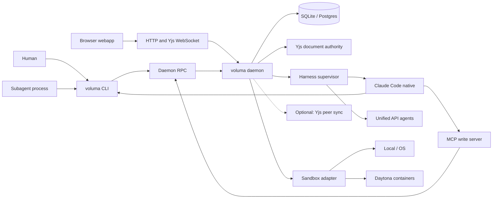
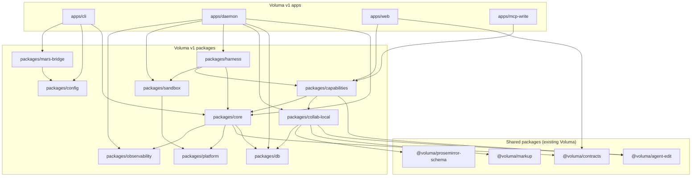
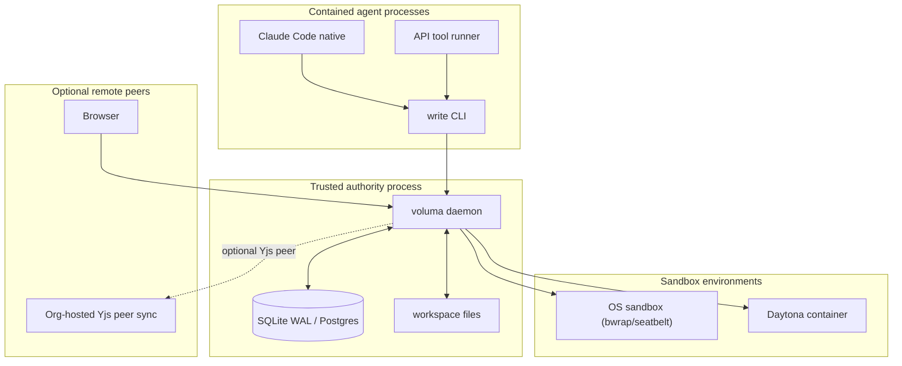
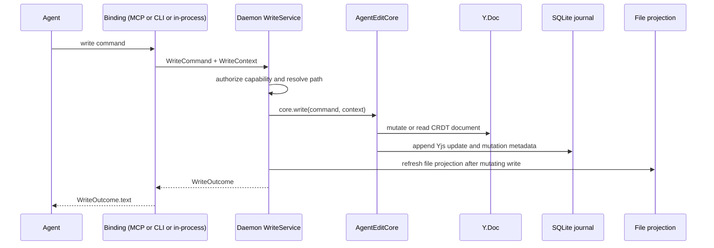
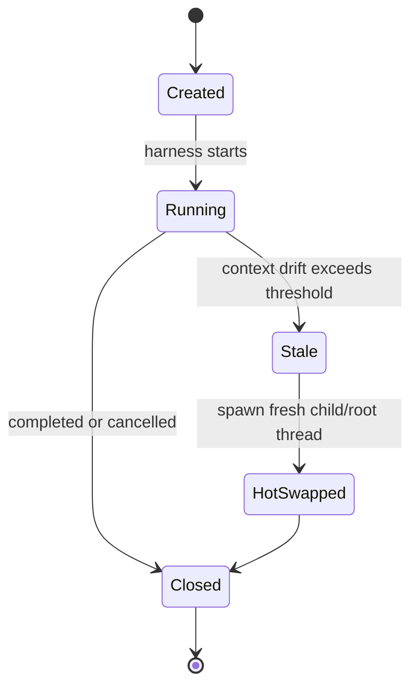
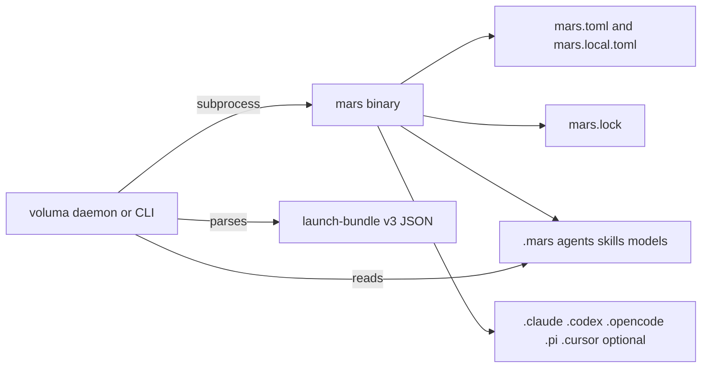

# Voluma v1 Architecture

> **Existing Voluma codebase:** [`../voluma`](/home/jimyao/gitrepos/voluma) — current cloud-native server with threads, runtime, sandbox (Daytona), collab domains. This rewrite reshapes that into a local-first surface with cloud sandbox underneath via the same mechanisms.

Voluma v1 is a local-first rewrite of the agent execution layer. It unifies what was previously split across meridian-cli (Python, personal dev tool), meridian-flow (cloud CRDT editing), and the existing Voluma server (cloud + Daytona sandbox for researchers). One architecture, deployed locally or hosted.

Its durable product difference is not another agent launcher; it is live CRDT collaboration between humans and agents over source files. Agents no longer mutate files directly through native Edit/Write tools. They call a shared `write` capability, and every write lands in the same Yjs authority that the web editor uses.

This document is the build target. It lives on a new branch in the Voluma repo.

## 1. Executive summary

v1 replaces three separate implementations with one local TypeScript authority process backed by SQLite/Postgres, Yjs, and shared packages.

**What v1 is**

- A local daemon that owns workspace state, CRDT documents, thread/spawn lifecycle, capability enforcement, and the web UI.
- A CLI surface that humans and agents call into; recursive subagents call the same CLI via bash (locally or in a remote sandbox).
- A webapp served by the same daemon for live file co-editing, agent threads, spawn status, events, token/cost views, and remote access.
- A small number of harness paths: native Claude Code, plus a unified API harness for embeddable/API providers.
- Deployable locally (SQLite, OS sandbox) or hosted (Postgres, Daytona sandbox) — same interfaces, different adapters.

**Why it exists**

- meridian-cli 0.x (Python) proved multi-agent spawning but hit the ceiling of stdout/CLI scraping.
- Voluma's cloud server proved threads, CRDT collab, and sandbox execution but is cloud-only.
- Researchers demand local-first data sovereignty. The product must run on their machine with no cloud dependency.
- Developers want the same agent tooling locally for daily work.

v1 unifies these into one engine: local by default, cloud when the org wants hosting.

**Differentiator**

The `write` capability is the product seam:

- Claude Code primary gets an MCP `write` tool and native Edit/Write denied.
- Subagents get a `write` CLI on `PATH` and use normal bash to call it (locally or inside a Daytona sandbox).
- Embedded/API agents call the same capability in-process.
- The web editor and all agents operate on the same Yjs documents, so human and agent edits merge by construction.

**Audiences**

| Persona | Mode | Primary surface | Deployment |
|---|---|---|---|
| Researcher | Research agents, data analysis, paper writing | Webapp | Local workstation or org-hosted |
| Developer | Code agents, refactoring, multi-repo | CLI + agents | Local laptop |
| Research org (hosted) | Managed instance for team | Webapp + admin | Private cloud / on-prem |

## 2. Product surfaces

Three user-visible surfaces share one authority process. They are not three implementations.

| Surface | Caller | Primary job | Process boundary | State authority |
|---|---|---|---|---|
| CLI | Human, Claude Code, subagents, prompts | Start sessions, spawn/wait/cancel, work/session/context commands, `write` command | CLI process → daemon RPC | Daemon + DB |
| Subagent spawning | Recursive `voluma spawn` from agents (local bash or sandbox bash) | Create child threads and subprocesses with bounded capability | Parent agent → CLI → daemon → harness | Daemon + DB |
| Webapp | Human browser/mobile | Live editor, thread UI, spawn dashboard, event/tokens/cost views | Browser → HTTP/WS daemon | Daemon + Yjs + DB |

DB = SQLite (local deployment) or Postgres (hosted deployment). Same schema, Drizzle adapter.

### Deployment modes

| Mode | Storage | Sandbox | Use case |
|---|---|---|---|
| **Local** | SQLite WAL | OS-level (bwrap/seatbelt) or none | Developer on laptop, researcher on workstation |
| **Hosted** | Postgres | Daytona containers | Org-managed instance, team collaboration |
| **Hybrid** | SQLite local + Postgres sync | Local execution + cloud state | Researcher with optional org backup |



### 2.1 CLI surface

The CLI is the compatibility surface prompts and agents already use. Commands that mutate runtime state should be thin clients to the daemon. Commands that are intentionally rootless/read-only may read config directly when no runtime exists.

Agent-critical command paths stay stable:

```text
voluma                           # primary launch
voluma spawn [create|wait|list|show|status|cancel|cancel-all|inject|children|subagents|files|stats|report]
voluma session [log|export|search|repair]
voluma work [dashboard|list|show|sessions|current|path|root|start|switch|done|reopen|update|delete|rename|clear|workspace]
voluma context [show|work|kb|...]
voluma mars <args...>
voluma doctor [--prune|--global|--kill-orphans]
voluma models list
write <command>                   # agent write interface (on PATH)
write ...                        # capability CLI for agent file edits
```

### 2.2 Subagent surface

A subagent is a child thread plus a child process. It inherits the session tree (`VOLUMA_CHAT_ID`), receives its own spawn ID (`VOLUMA_SPAWN_ID`), its parent ID (`VOLUMA_PARENT_SPAWN_ID`), depth (`VOLUMA_DEPTH`), workspace, work context, daemon endpoint, and a narrowed capability token.

Subagents do not get a special edit path. Their write path is intentionally boring:

```bash
write '{"command":"replace","file":"src/main.ts","find":"old","content":"new"}'
```

The `write` binary validates local context, forwards to the daemon, prints `WriteOutcome.text`, and exits `0` on success or nonzero on errors.

### 2.3 Webapp surface

The webapp is the product shell around the same state:

- File tree and tracked-document registry.
- TipTap/Yjs editor for files.
- Agent thread timeline and tool/write outcomes.
- Spawn tree with status, depth, capability, token/cost, and lifecycle events.
- Work item dashboard and artifact links.
- Observability panes backed by structured events and OTel traces.

Remote access is local-first: bind to localhost by default, allow explicit Tailscale/private-network binding, and never require cloud sync.

## 3. System architecture

The stable dependency direction is from app surfaces toward shared packages and domain ports. Existing Voluma packages (`@voluma/agent-edit`, `@voluma/contracts`, etc.) are library dependencies reshaped for local-first use, not a forked app base.



### 3.1 Package structure

Use a plain pnpm workspace first. Add Nx/Turborepo only if build graph size justifies it. The package split should reflect stable seams, not implementation layering for its own sake.

```text
apps/
  cli/                 # human/agent CLI entrypoint, command parser, daemon client
  daemon/              # local authority process, HTTP/RPC/WS server, composition root
  web/                 # React/TanStack/Vite web UI built and served by daemon
  mcp-write/           # stdio MCP facade for Claude Code write tool

packages/
  core/                # spawn/session/thread/work domain services and policies
  db/                  # Drizzle schema, migrations, repositories (SQLite + Postgres adapters)
  collab-local/        # agent-edit port adapters, Y.Doc cache, file projection
  capabilities/        # write/read/search/ask bindings, capability enforcement facade
  harness/             # Claude Code native + unified API harness supervisor
  sandbox/             # sandbox strategy adapters (OS bwrap/seatbelt + Daytona containers)
  mars-bridge/         # mars subprocess adapter, launch-bundle v3 parser
  config/              # voluma config, env/CLI/YAML precedence, root resolution
  platform/            # process trees, paths, OS abstractions
  observability/       # event sink, OTel spans, metrics, trace context
  test-support/        # fakes and smoke harnesses, not production dependencies
```

### 3.2 Component responsibilities

| Component | Owns | Must not own |
|---|---|---|
| `apps/daemon` | Composition root, HTTP/RPC/WS routes, daemon lifecycle | Domain policy embedded in routes |
| `packages/core` | Spawn lifecycle, thread lifecycle, work/session semantics, capability policy | Harness-specific launch args, Yjs mutations |
| `packages/collab-local` | Agent-edit ports, Y.Doc cache, file/document projection, journal adapter | Spawn lifecycle, prompt assembly |
| `packages/capabilities` | Stable capability APIs and bindings (`write`, future mediated tools) | Per-harness behavior |
| `packages/harness` | Process/API execution, event normalization, control/inject bridge | State authority, config precedence |
| `packages/sandbox` | Sandbox strategy (OS bwrap/seatbelt, Daytona), process containment, filesystem isolation | Business rules, spawn lifecycle |
| `packages/db` | Schema, migrations, repository transactions (SQLite + Postgres via Drizzle) | Business rules beyond consistency constraints |
| `packages/mars-bridge` | `mars` binary resolution, passthrough, launch-bundle parsing | Package resolution or target lowering |

### 3.3 Process and trust boundaries



The daemon is the only local authority. Agent processes are not trusted to report their capabilities, status, or allowed descendants. Environment variables are hints for compatibility; the daemon enforces policy from DB records and capability tokens.

## 4. CRDT write seam

The write seam has three bindings and one authority. The authority is `WriteService`, composed in the daemon from `@voluma/agent-edit` plus local adapters.



### 4.1 Shared authority interface

`@voluma/agent-edit` already defines the core write surface. v1 wraps it with host responsibilities: authorization, path resolution, context binding, projection refresh, and events.

```ts
export interface WriteService {
  write(input: HostWriteInput): Promise<WriteOutcome>;
  undo(input: HostUndoRedoInput): Promise<WriteOutcome>;
  redo(input: HostUndoRedoInput): Promise<WriteOutcome>;
  commitResponse(responseId: string): Promise<ResponseCommitResult>;
  rollbackResponse(responseId: string): Promise<ResponseRollbackResult>;
}

export interface HostWriteInput {
  command: WriteCommand;
  context: WriteContext;
  actor: ActorRef;
  capabilityToken: string;
  cwd: string;
}

export interface ActorRef {
  spawnId?: string;       // p<N>
  chatId?: string;        // c<N>
  threadId: string;
  sessionId: string;
  turnId?: string;
  origin: "mcp" | "cli" | "web" | "api";
}
```

### 4.2 Binding 1: Claude Code MCP tool

Claude Code stays native for subscription auth, TUI, and its tool ecosystem. For file writes, v1 supplies an MCP `write` server and denies native file-mutating tools.

- MCP schema imports `WriteCommandSchema` from `@voluma/agent-edit`.
- The MCP process uses `VOLUMA_DAEMON_URL` and `VOLUMA_CAPABILITY_TOKEN` to call the daemon.
- If the MCP server is embedded by the daemon in a future Claude transport, it can call `WriteService` directly; the contract does not change.
- Tool result content is exactly `WriteOutcome.text` plus optional structured blocks when Claude supports them.

### 4.3 Binding 2: bash `write` CLI

The `write` CLI is a thin RPC client designed for subagents and fallback shell use.

```bash
write '{"command":"read","file":"src/main.ts"}'
write replace --file src/main.ts --find "old" --content "new"
write undo --file src/main.ts --last 1
```

The JSON form is canonical. Friendly flags compile to the same `WriteCommand` object.

```ts
interface WriteCliRequest {
  command: WriteCommandName;
  file: string;
  documentId?: string;
  tool_use_id?: string;
  // command-specific fields are validated by WriteCommandSchema
}
```

Runtime behavior:

1. Read JSON arg or parse friendly flags.
2. Attach context from environment: `VOLUMA_SPAWN_ID`, `VOLUMA_CHAT_ID`, `VOLUMA_THREAD_ID`, `VOLUMA_TURN_ID`, `VOLUMA_CAPABILITY_TOKEN`.
3. POST to `VOLUMA_DAEMON_URL`.
4. Print `WriteOutcome.text` to stdout.
5. Exit `0` when `isError=false`, `1` for validation/write errors, `2` for daemon/connectivity errors.

### 4.4 Binding 3: in-process embedded/API agents

Embedded/API agents call the same `WriteService` object inside the daemon. They do not go through HTTP unless running in a separate tool-runner sandbox. The tool definition still uses `WriteCommandSchema`; direct file mutation tools are not exposed.

### 4.5 Command schema

The LLM-facing command schema is inherited from `@voluma/agent-edit` and treated as stable.

| Command | Required | Optional fields |
|---|---|---|
| `create` | `file` | `content`, `overwrite`, `documentId`, `tool_use_id` |
| `read` | `file` | `in`, `around`, `format`, `documentId`, `tool_use_id` |
| `insert` | `file`, `content` | `after`, `before`, `find`, `in`, `around`, `all`, `documentId`, `tool_use_id` |
| `replace` | `file`, `content` | `find`, `in`, `around`, `all`, `documentId`, `tool_use_id` |
| `undo` | `file` | `to`, `from`, `last`, `all`, `documentId`, `tool_use_id` |
| `redo` | `file` | `to`, `from`, `last`, `all`, `documentId`, `tool_use_id` |

Host-only context is never exposed as model parameters:

```ts
interface WriteContext {
  session?: ActorSession;
  externalId?: string;
  sessionId?: string;
  threadId?: string;
  turnId?: string;
  tool_use_id?: string;
  responseId?: string;
  createdDocument?: boolean;
}
```

### 4.6 Output format

The CLI and MCP bindings return the same model-readable text. No binding-specific paraphrase is allowed.

```text
status: success
w3 | replaced 1 match in src/main.ts
9ab12c|export function main() {
```

`WriteOutcome` shape:

```ts
interface WriteOutcome {
  command: WriteCommandName;
  status: "success" | WriteErrorStatus | UndoRedoOutcome;
  isError: boolean;
  writeId?: string;          // w<N> for mutating writes
  text: string;              // stdout/tool-result authority
  content?: WriteResultBlock[];
  error?: WriteErrorDetail;  // if using draft-simplify successor
}
```

### 4.7 File to CRDT projection

Each tracked file maps to one document row and one Yjs document.

- **Cold open:** disk file is parsed through a code/prose codec into ProseMirror blocks, then checkpointed if the document has no journal.
- **Active session:** Yjs is authoritative. Agent writes, human edits, and daemon-mediated file changes mutate Yjs first, then refresh the file projection.
- **External disk change:** the watcher classifies it as an external actor edit. If a Y.Doc is active, import the change as a concurrent update. If inactive, disk remains authority and the next open refreshes the CRDT document after safety checks.
- **Large/binary files:** do not track by default. Read/search may expose summaries, but `write` rejects binary or over-limit files unless an explicit codec exists.

Initial code codec decision: line-oriented source files, one top-level block per logical line range, preserving exact text on serialize. Tree-sitter-aware block boundaries are a later optimization and must not change the public write schema.

## 5. Harness architecture

v1 deliberately avoids rebuilding five native harness adapters. It supports two harness classes.

| Harness class | Examples | Why | Write binding |
|---|---|---|---|
| Claude Code native | `claude -p --output-format stream-json --verbose -` | Subscription auth, native TUI, full Claude Code ecosystem | MCP `write` + bash `write` fallback |
| Unified API harness | Anthropic API, OpenAI, Gemini, provider SDKs, AI SDK | One embeddable runtime surface | In-process `WriteService` tool |

Cursor, Pi, OpenCode, and Codex native adapters are not carried as v1 native harnesses. They can remain in the legacy CLI or be represented through the unified API harness when feasible.

### 5.1 Spawn lifecycle

The status vocabulary is preserved:

```ts
type SpawnStatus =
  | "queued"
  | "running"
  | "finalizing"
  | "succeeded"
  | "failed"
  | "cancelled"
  | "timed_out";
```

Allowed transitions:

```text
queued     -> running | succeeded | failed | cancelled | timed_out
running    -> finalizing | succeeded | failed | cancelled | timed_out
finalizing -> succeeded | failed | cancelled | timed_out
```

Daemon-owned lifecycle operations:

```ts
interface SpawnLifecycleService {
  reserve(input: SpawnReserveInput): Promise<SpawnRecord>;
  markRunning(spawnId: string, runner: RunnerRef): Promise<void>;
  recordExited(spawnId: string, exit: ProcessExit): Promise<void>;
  markFinalizing(spawnId: string): Promise<boolean>; // CAS running -> finalizing
  finalize(spawnId: string, outcome: FinalOutcome): Promise<void>;
  cancel(spawnId: string, reason: CancelReason): Promise<void>;
}
```

Completion report evidence still wins over late cancel signals. Terminal writes use an authority lattice equivalent to Python 0.x: runner/launcher/cancel origins supersede reconciler writes for the same spawn, and terminal state is monotonic.

### 5.2 Claude Code native path

Launch responsibilities:

1. Resolve launch bundle from mars.
2. Assemble and freeze the thread system prompt.
3. Create spawn/thread rows before process launch.
4. Create narrowed capability and token.
5. Inject environment, controlled `PATH`, MCP config, and deny rules.
6. Spawn Claude Code under a platform process scope.
7. Persist harness stream events before observing and fan-out.
8. Observe terminal result, then finalize.

Claude-specific preserved behavior:

- Native Claude Code is the only harness allowed to keep provider-specific TUI/subscription behavior.
- Large skill bodies use file-based prompt append rather than huge argv strings.
- `.claude/settings.json` denies `Edit`, `Write`, and `NotebookEdit`; strict mode also denies known bash file writers and relies on OS/Daytona sandboxing.
- Built-in generic `Agent` remains denied in managed prompts; delegation goes through `voluma spawn`.

### 5.3 Unified API harness path

The API harness owns model invocation, tool execution, and response lifecycle for embeddable providers. It emits the same normalized events as Claude Code but does not need stdout scraping.

```ts
interface AgentHarness {
  id: "claude-code" | "api";
  launch(input: HarnessLaunchInput): Promise<HarnessRunHandle>;
}

interface HarnessRunHandle {
  spawnId: string;
  interrupt(message?: string): Promise<void>;
  inject(input: UserInjection): Promise<void>;
  stop(reason: string): Promise<void>;
  events(): AsyncIterable<HarnessEvent>;
}
```

Canonical event envelope:

```ts
interface HarnessEvent {
  seq?: number;
  spawnId: string;
  threadId: string;
  turnId?: string;
  itemId?: string;
  requestId?: string;
  eventType: string;
  harnessId: "claude-code" | "api";
  payload: unknown;
  rawText?: string;
  observedAt: string;
}
```

The old per-harness terminal classifiers are deleted except for Claude Code native. API harness completion is explicit from the model runtime.

### 5.4 Just-bash model for subagent writes

Subagents are allowed real shell access for local development, tests, and inspection. File writes should route through `write` by prompt, tool policy, and sandbox. The same model applies whether bash runs on the local machine or inside a Daytona container:

- **Advisory mode:** deny native Edit/Write, put `write` first on `PATH`, shadow/deny common shell file writers, and detect out-of-band file changes as external edits.
- **Strict CRDT mode (local):** run the agent in an OS sandbox (bwrap/seatbelt) where source roots are read-only; the daemon write broker is the only writer to tracked source files.
- **Strict CRDT mode (hosted):** run the agent in a Daytona container with source mounted read-only; writes route back to the daemon over the network.
- **Capability elevation:** commands that intentionally mutate outside CRDT control, such as dependency installation or generated target sync, require a separate capability grant and are shown in the UI/events.

This keeps v1 honest: CRDT write is enforceable in strict mode and observable in advisory mode. The just-bash insight — agents call `voluma spawn` and `write` via the same CLI regardless of sandbox strategy — is what makes local and hosted deployments share one architecture.

## 6. Data model

A relational DB replaces runtime files as authoritative state. Local deployments use SQLite (WAL mode); hosted deployments use Postgres. Same Drizzle schema, different dialect adapter. The old files-as-state invariant is deliberately broken for v1 runtime, but the crash-only spirit remains: transactional writes, append-only journals where order matters, idempotent recovery on daemon startup.

### 6.1 Database configuration and migrations

**SQLite (local mode)** — required pragmas at connection open:

```sql
PRAGMA journal_mode = WAL;
PRAGMA foreign_keys = ON;
PRAGMA synchronous = NORMAL;
PRAGMA busy_timeout = 5000;
```

**Postgres (hosted mode)** — standard connection pooling, `pg_advisory_lock` for daemon leader election in multi-instance hosted deployments.

Migrations are Drizzle-owned. The daemon refuses to start on unknown newer schema versions and offers explicit migration commands for older versions. Schema is dialect-neutral; avoid SQLite-specific extensions unless behind an adapter guard.

### 6.2 Core identity tables

```sql
CREATE TABLE projects (
  id TEXT PRIMARY KEY,                 -- stable project UUID, not human slug
  root_path TEXT NOT NULL UNIQUE,
  created_at TEXT NOT NULL,
  last_opened_at TEXT NOT NULL
);

CREATE TABLE id_counters (
  scope TEXT NOT NULL,                 -- project id or global
  kind TEXT NOT NULL,                  -- spawn | chat | thread | turn | event
  next_int INTEGER NOT NULL,
  PRIMARY KEY (scope, kind)
);
```

Carry the human-facing ID shapes:

- Spawn IDs: `p<N>` monotonic per project.
- Chat/session IDs: `c<N>` monotonic per project.
- Internal threads/turns may use prefixed IDs or ULIDs, but CLI-visible references must continue accepting `p123`, `c123`, `@latest`, `@last-failed`, and `@last-completed`.

### 6.3 Sessions, threads, turns

```sql
CREATE TABLE sessions (
  id TEXT PRIMARY KEY,                 -- c<N>
  project_id TEXT NOT NULL REFERENCES projects(id) ON DELETE CASCADE,
  root_thread_id TEXT,
  active_work_id TEXT,
  status TEXT NOT NULL CHECK (status IN ('active','stopped','crashed')),
  started_at TEXT NOT NULL,
  stopped_at TEXT,
  metadata_json TEXT NOT NULL DEFAULT '{}'
);

CREATE TABLE threads (
  id TEXT PRIMARY KEY,
  session_id TEXT NOT NULL REFERENCES sessions(id) ON DELETE CASCADE,
  parent_thread_id TEXT REFERENCES threads(id) ON DELETE SET NULL,
  spawn_id TEXT,                       -- nullable for primary before spawn row link
  harness TEXT NOT NULL,
  model TEXT,
  agent_name TEXT,
  system_prompt_hash TEXT NOT NULL,
  system_prompt_snapshot TEXT NOT NULL,
  context_snapshot_json TEXT NOT NULL DEFAULT '{}',
  cache_policy_json TEXT NOT NULL DEFAULT '{}',
  status TEXT NOT NULL CHECK (status IN ('open','stale','closed')),
  created_at TEXT NOT NULL,
  closed_at TEXT
);

CREATE TABLE turns (
  id TEXT PRIMARY KEY,
  thread_id TEXT NOT NULL REFERENCES threads(id) ON DELETE CASCADE,
  response_id TEXT,
  ordinal INTEGER NOT NULL,
  status TEXT NOT NULL CHECK (status IN ('started','committed','rolled_back','failed')),
  started_at TEXT NOT NULL,
  finished_at TEXT,
  input_summary TEXT,
  usage_json TEXT NOT NULL DEFAULT '{}',
  UNIQUE(thread_id, ordinal)
);
```

### 6.4 Spawns

```sql
CREATE TABLE spawns (
  id TEXT PRIMARY KEY,                 -- p<N>
  project_id TEXT NOT NULL REFERENCES projects(id) ON DELETE CASCADE,
  session_id TEXT NOT NULL REFERENCES sessions(id) ON DELETE CASCADE,
  thread_id TEXT REFERENCES threads(id) ON DELETE SET NULL,
  parent_id TEXT REFERENCES spawns(id) ON DELETE SET NULL,
  owner_chat_id TEXT NOT NULL,
  originating_bash_id TEXT,
  depth INTEGER NOT NULL DEFAULT 0,

  harness TEXT NOT NULL,
  kind TEXT NOT NULL DEFAULT 'subagent',
  model TEXT,
  agent_name TEXT,
  agent_path TEXT,
  skills_json TEXT NOT NULL DEFAULT '[]',
  skill_paths_json TEXT NOT NULL DEFAULT '[]',
  goal TEXT,
  description TEXT,
  display_label TEXT,
  work_id TEXT,

  control_root TEXT NOT NULL,
  task_cwd TEXT NOT NULL,
  execution_cwd TEXT NOT NULL,
  launch_mode TEXT NOT NULL,
  launch_policy_snapshot_json TEXT NOT NULL DEFAULT '{}',

  capability_json TEXT NOT NULL,
  capability_token_hash TEXT NOT NULL,

  status TEXT NOT NULL CHECK (status IN ('queued','running','finalizing','succeeded','failed','cancelled','timed_out')),
  terminal_origin TEXT,
  cancel_intent TEXT,
  error TEXT,
  exit_code INTEGER,

  worker_pid INTEGER,
  runner_pid INTEGER,
  runner_created_at_epoch REAL,
  harness_session_id TEXT,
  last_heartbeat_at TEXT,

  started_at TEXT NOT NULL,
  running_at TEXT,
  finished_at TEXT,
  duration_ms INTEGER,
  token_input INTEGER DEFAULT 0,
  token_output INTEGER DEFAULT 0,
  token_total INTEGER DEFAULT 0,
  cost_usd REAL DEFAULT 0,

  revision INTEGER NOT NULL DEFAULT 0,
  created_at TEXT NOT NULL,
  updated_at TEXT NOT NULL
);

CREATE INDEX spawns_project_status_idx ON spawns(project_id, status, started_at DESC);
CREATE INDEX spawns_parent_idx ON spawns(parent_id);
CREATE INDEX spawns_session_idx ON spawns(session_id);
CREATE INDEX spawns_work_idx ON spawns(work_id);
```

### 6.5 Work items

Work item directories remain user-visible authority for artifacts. The DB stores index metadata and relationships; the directory still carries human-authored artifacts and `__status.json` compatibility metadata if needed.

```sql
CREATE TABLE work_items (
  id TEXT PRIMARY KEY,                 -- slug
  project_id TEXT NOT NULL REFERENCES projects(id) ON DELETE CASCADE,
  title TEXT,
  status TEXT NOT NULL,
  active_dir TEXT NOT NULL,
  archive_dir TEXT NOT NULL,
  workspace TEXT,                      -- default workspace for spawns on this work item
  created_at TEXT NOT NULL,
  updated_at TEXT NOT NULL,
  archived_at TEXT,
  metadata_json TEXT NOT NULL DEFAULT '{}'
);
```

**Workspace resolution** (replaces the old 6-level `task_dir` cascade):

1. Explicit `--workspace` flag on spawn command
2. Work item default workspace (`work_items.workspace`)
3. Project root

The daemon resolves workspace at spawn creation time and sets the process cwd. No env propagation needed for resolution — agents inherit `VOLUMA_WORKSPACE` for informational use only.

### 6.6 Documents and file projection

```sql
CREATE TABLE documents (
  id TEXT PRIMARY KEY,
  project_id TEXT NOT NULL REFERENCES projects(id) ON DELETE CASCADE,
  relative_path TEXT NOT NULL,
  absolute_path TEXT NOT NULL,
  kind TEXT NOT NULL CHECK (kind IN ('source','markdown','text','generated','binary')),
  codec TEXT NOT NULL,
  schema_version INTEGER NOT NULL,
  tracking_status TEXT NOT NULL CHECK (tracking_status IN ('tracked','ignored','deleted')),
  disk_hash TEXT,
  yjs_head_seq INTEGER NOT NULL DEFAULT 0,
  last_projected_at TEXT,
  created_at TEXT NOT NULL,
  updated_at TEXT NOT NULL,
  UNIQUE(project_id, relative_path)
);

CREATE TABLE thread_documents (
  thread_id TEXT NOT NULL REFERENCES threads(id) ON DELETE CASCADE,
  document_id TEXT NOT NULL REFERENCES documents(id) ON DELETE CASCADE,
  role TEXT NOT NULL CHECK (role IN ('read','write','mentioned','active')),
  first_seen_turn_id TEXT,
  last_seen_turn_id TEXT,
  PRIMARY KEY (thread_id, document_id)
);
```

### 6.7 Agent-edit journal and reversal tables

These tables implement `UpdateJournal` and `ReversalStore` locally. Names mirror the existing Voluma server where practical.

```sql
CREATE TABLE document_yjs_heads (
  document_id TEXT PRIMARY KEY REFERENCES documents(id) ON DELETE CASCADE,
  latest_seq INTEGER NOT NULL DEFAULT 0,
  checkpoint_seq INTEGER NOT NULL DEFAULT 0,
  schema_version INTEGER NOT NULL,
  updated_at TEXT NOT NULL
);

CREATE TABLE document_yjs_updates (
  document_id TEXT NOT NULL REFERENCES documents(id) ON DELETE CASCADE,
  seq INTEGER NOT NULL,
  update_blob BLOB NOT NULL,
  origin TEXT NOT NULL,                -- agent | human | external | system
  actor_id TEXT,
  thread_id TEXT,
  turn_id TEXT,
  write_id TEXT,
  meta_json TEXT NOT NULL DEFAULT '{}',
  created_at TEXT NOT NULL,
  PRIMARY KEY (document_id, seq)
);

CREATE TABLE document_yjs_checkpoints (
  document_id TEXT NOT NULL REFERENCES documents(id) ON DELETE CASCADE,
  seq INTEGER NOT NULL,
  state_blob BLOB NOT NULL,
  state_vector_blob BLOB,
  created_at TEXT NOT NULL,
  PRIMARY KEY (document_id, seq)
);

CREATE TABLE agent_edit_wid_counters (
  document_id TEXT NOT NULL REFERENCES documents(id) ON DELETE CASCADE,
  thread_id TEXT NOT NULL REFERENCES threads(id) ON DELETE CASCADE,
  next_wid INTEGER NOT NULL,
  PRIMARY KEY (document_id, thread_id)
);

CREATE TABLE agent_edit_mutations (
  document_id TEXT NOT NULL REFERENCES documents(id) ON DELETE CASCADE,
  thread_id TEXT NOT NULL REFERENCES threads(id) ON DELETE CASCADE,
  write_id TEXT NOT NULL,              -- w<N>
  turn_id TEXT,
  response_id TEXT,
  command TEXT NOT NULL,
  status TEXT NOT NULL,
  update_from_seq INTEGER,
  update_to_seq INTEGER,
  touched_hashes_json TEXT NOT NULL DEFAULT '[]',
  deleted_hashes_json TEXT NOT NULL DEFAULT '[]',
  created_at TEXT NOT NULL,
  PRIMARY KEY (document_id, thread_id, write_id)
);

CREATE TABLE document_yjs_reversals (
  id TEXT PRIMARY KEY,
  document_id TEXT NOT NULL REFERENCES documents(id) ON DELETE CASCADE,
  thread_id TEXT NOT NULL REFERENCES threads(id) ON DELETE CASCADE,
  write_id TEXT NOT NULL,
  kind TEXT NOT NULL CHECK (kind IN ('undo','redo')),
  status TEXT NOT NULL,
  created_at TEXT NOT NULL,
  meta_json TEXT NOT NULL DEFAULT '{}'
);

CREATE TABLE document_yjs_reversal_ops (
  reversal_id TEXT NOT NULL REFERENCES document_yjs_reversals(id) ON DELETE CASCADE,
  document_id TEXT NOT NULL REFERENCES documents(id) ON DELETE CASCADE,
  seq INTEGER NOT NULL,
  PRIMARY KEY (reversal_id, seq)
);
```

If v1 pins to the current `h/v3` package surface, add `agent_edit_sync_state(document_id, thread_id, state_vector, synced_snapshot, committed_snapshot)`. If v1 pins to the `draft-simplify` successor, do not create durable sync-state; provide interaction context at write time.

### 6.8 Events and observability

```sql
CREATE TABLE events (
  id TEXT PRIMARY KEY,
  project_id TEXT NOT NULL REFERENCES projects(id) ON DELETE CASCADE,
  seq INTEGER NOT NULL,
  event_type TEXT NOT NULL,
  severity TEXT NOT NULL DEFAULT 'info',
  spawn_id TEXT REFERENCES spawns(id) ON DELETE SET NULL,
  session_id TEXT REFERENCES sessions(id) ON DELETE SET NULL,
  thread_id TEXT REFERENCES threads(id) ON DELETE SET NULL,
  turn_id TEXT,
  trace_id TEXT,
  span_id TEXT,
  payload_json TEXT NOT NULL DEFAULT '{}',
  raw_text TEXT,
  created_at TEXT NOT NULL,
  UNIQUE(project_id, seq)
);

CREATE INDEX events_spawn_idx ON events(spawn_id, created_at);
CREATE INDEX events_thread_idx ON events(thread_id, created_at);
CREATE INDEX events_type_idx ON events(project_id, event_type, created_at DESC);
```

Persist-before-observe ordering carries forward: for harness streams, write the event/update to durable storage before terminal observation and subscriber fan-out.

## 7. Capability and security

The capability model is D8 from the audit, promoted to a first-class runtime contract.

```ts
interface SpawnCapability {
  own: PermissionSet;
  delegation: PermissionSet;
  max_depth: number;
}

interface PermissionSet {
  tools: ToolGrant[];
  files: FileGrant[];
  commands: CommandGrant[];
  network: NetworkGrant;
  env_grants: EnvGrant[];
  secret_grants: SecretGrant[];
  spawn: SpawnGrant;
  sandbox: SandboxGrant;
}
```

Invariant:

```text
child.own        <= parent.delegation
child.delegation <= parent.delegation
child.max_depth  <= parent.max_depth - 1
```

Depth retains Python semantics: primary depth is `0`; child depth is parent + 1; spawning is blocked when `current >= max`.

### 7.1 Enforcement points

| Boundary | Enforcement |
|---|---|
| CLI -> daemon | Capability token required for spawn-scoped mutations; daemon loads stored capability and ignores caller-provided authority |
| MCP/CLI `write` | Validate token, actor, file grant, command grant, and sandbox mode before path resolution |
| Spawn creation | Parent delegation checked before row reservation; blocked spawns return depth/capability errors without side effects |
| Harness launch | Environment built from capability grants; secrets and unknown `VOLUMA_*` are stripped |
| Sandbox | OS strategy applies the file/command/network subset feasible on the host |
| Webapp | Local user trusted by default; remote binding requires explicit auth token and project-level grants |

### 7.2 Sandbox modes

Expose user-facing modes compatible with current prompts while mapping them to v1 strategies:

| Mode | Meaning | Local implementation | Hosted implementation |
|---|---|---|---|
| `read-only` | Agent cannot mutate tracked source files except through daemon capabilities | bwrap read-only bind, seatbelt profile | Daytona container with read-only source mount |
| `workspace-write` | Agent may write approved workspace paths; CRDT tracked files still prefer `write` | OS sandbox plus file grants | Daytona with scoped writable mounts |
| `danger-full-access` | No filesystem containment; capability enforcement still applies to daemon APIs | Local dev escape hatch | Daytona with full workspace access |
| `none` | Alias for uncontained local execution for native harnesses that cannot be sandboxed | Explicit and visible | Not available in hosted mode |

Strict CRDT enforcement requires `read-only` source roots plus the daemon write broker. `workspace-write` and `danger-full-access` remain useful but can only detect/direct, not cryptographically prevent, out-of-band writes.

The sandbox adapter interface:

```ts
interface SandboxAdapter {
  strategy: "os" | "daytona" | "none";
  createSandbox(config: SandboxConfig): Promise<SandboxHandle>;
  destroySandbox(handle: SandboxHandle): Promise<void>;
}

interface SandboxHandle {
  exec(command: string[], opts: ExecOpts): Promise<ExecResult>;
  writeFile(path: string, content: Buffer): Promise<void>;
  readFile(path: string): Promise<Buffer>;
  dispose(): Promise<void>;
}
```

### 7.3 Secrets

Secrets are grants, not ambient environment inheritance.

```ts
interface SecretGrant {
  name: string;              // logical name, not raw env var by default
  envVar?: string;           // if materialized into a child env
  scope: "spawn" | "thread" | "project";
  expiresAt?: string;
}
```

Default child env strips `*_TOKEN`, `*_KEY`, and `*_SECRET` unless a grant permits them. `VOLUMA_SECRET_<KEY>` remains a supported input convention, but materialization is explicit.

## 8. Thread model

Threads are conversation/runtime objects. Spawns are process/lifecycle objects. A spawn normally owns one thread; a primary session starts with one root thread; child spawns create child threads.

### 8.1 Lifecycle



Thread creation steps:

1. Resolve config and mars launch bundle.
2. Resolve work/task/context roots.
3. Assemble system prompt from agent body, loaded skills, invariant injections, capability instructions, and current context summary.
4. Hash and store `system_prompt_snapshot` and `context_snapshot_json`.
5. Freeze the prompt for the life of the thread.
6. Launch harness with thread IDs and capability context.

### 8.2 Cache invariant

System prompts are immutable after thread creation. This preserves provider prompt-cache behavior and avoids invisible mid-session instruction changes.

- Updated context flows through tool results, explicit read/list/search calls, and bounded injection messages.
- Work status or file changes do not rewrite the system prompt.
- When context drift matters, create a new thread with a fresh prompt and link it to the old thread as a hot-swap.
- The webapp should show drift signals and offer hot-swap rather than pretending the existing thread has learned new global instructions.

### 8.3 Thread to document mapping

- A file maps to one live Yjs document.
- A thread maps to zero or more documents through `thread_documents` as it reads or writes.
- `turnId` groups writes for undo/redo and UI attribution.
- `responseId` groups staged writes for model-response commit/rollback when using the agent-edit response lifecycle.

If adopting `draft-simplify`, thread-peer branches become the default write target for API/embedded agents, with live projection controlled by branch push/review. Claude Code native can start on live mode for v1, then adopt branch mode when review UX is ready.

### 8.4 Parent-child relationships

Carry existing semantics:

- `VOLUMA_CHAT_ID` is inherited across the spawn tree.
- `VOLUMA_SPAWN_ID` identifies the current spawn.
- `VOLUMA_PARENT_SPAWN_ID` links to the parent.
- `VOLUMA_DEPTH` is zero-based and fail-closed when malformed.
- `spawn children`, subtree cancel, and webapp tree views use stored `parent_id`, not env inspection.

## 9. Observability

Observability is a product surface, not a log tail bolted on later.

### 9.1 Events

All durable events go through an `EventSink`:

```ts
interface EventSink {
  emit(event: EventInput): Promise<void>;
}

interface EventInput {
  eventType: string;
  severity?: "debug" | "info" | "warn" | "error";
  spawnId?: string;
  sessionId?: string;
  threadId?: string;
  turnId?: string;
  traceId?: string;
  spanId?: string;
  payload?: unknown;
  rawText?: string;
}
```

Required event families:

```text
spawn.created
spawn.running
spawn.finalizing
spawn.finalized
spawn.cancel_requested
harness.event
harness.error
thread.created
thread.hot_swapped
turn.started
turn.committed
turn.failed
write.started
write.completed
write.failed
document.tracked
document.projected
document.external_change
mars.command
sandbox.violation
capability.denied
```

Hook failures, projection refresh failures, and debug trace failures never roll back committed state; they emit error events.

### 9.2 OpenTelemetry spans

Required span names:

```text
voluma.cli.command
voluma.spawn.reserve
voluma.spawn.launch
voluma.harness.turn
voluma.harness.tool_call
voluma.write
voluma.agent_edit.core_write
voluma.yjs.journal_append
voluma.document.projection_refresh
voluma.mars.launch_bundle
voluma.sandbox.exec
```

Trace context propagates parent -> child spawn through environment and stored spawn rows. The webapp can reconstruct spawn trees even when OTel export is disabled.

### 9.3 Dashboard views

The webapp queries the DB and live daemon memory to show:

- Active spawn tree with status, elapsed time, depth, model, agent, task dir, and current turn.
- Token/cost totals by session/thread/spawn.
- Write timeline per document with `w<N>` handles and concurrent edit indicators.
- Error and capability-denied stream.
- Reaper/recovery actions taken at daemon startup.

## 10. mars-agents integration

mars-agents remains Rust and remains the prompt package manager. v1 does not reimplement package resolution, lock ownership, target lowering, model aliases, or launch-bundle construction.

### 10.1 Integration contract



Preserve:

- `voluma mars <args>` passthrough.
- Bundled/sibling `mars` binary resolution before `PATH`.
- Inject `--root <VOLUMA_PROJECT_DIR>` when caller did not pass `--root`.
- Set `VOLUMA_MANAGED=1` for mars subprocesses.
- Propagate mars passthrough exit codes: `0`, `1`, `2`, `3`.
- Use `mars build launch-bundle --json` as the launch policy authority; require schema v3 until mars publishes a new version and v1 explicitly migrates.
- Read agent catalog from `.mars/agents/`, not harness-native target dirs.
- Treat `mars.lock` ownership identity as `(target_root, dest_path, installed_checksum)`.

### 10.2 What simplifies

At the Voluma layer, v1 only needs native Claude Code target materialization plus canonical `.mars/` for its own catalog. However, mars still knows five harness targets until mars itself changes. Reducing configured targets is a project-template choice, not a Voluma-side reimplementation.

### 10.3 Launch bundle adapter

```ts
interface LaunchBundleV3 {
  version: 3;
  routing: {
    model: string;
    model_token?: string;
    harness: string;
    harness_model: string;
  };
  execution_policy: {
    effort?: string;
    approval?: string;
    sandbox?: string;
    autocompact?: boolean;
    timeout?: number;
  };
  tools: {
    allowed: string[];
    disallowed: string[];
    mcp: unknown[];
  };
  skills: {
    loaded: Array<{ name: string; skill_type: string; body: string }>;
    available: unknown[];
    missing: unknown[];
  };
  prompt_surface: { inventory_prompt?: string };
  provenance: unknown;
  warnings: string[];
  agent_body?: string;
}
```

Failure semantics match current call sites: optional catalog/outdated calls degrade gracefully; launch-bundle failures are hard launch failures with mars stderr surfaced.

## 11. Performance

Targets:

| Operation | Target | Design choices |
|---|---:|---|
| `write` CLI round trip | `<50ms` | Persistent daemon, HTTP first, UDS fallback if needed, no Node cold start per write |
| Webapp TTI | `<1s` local | Serve built assets, lazy-load editor/docs, query indexed SQLite |
| Spawn creation | `<100ms` before harness process start | Resolve-before-persist, single DB transaction, cached mars catalog where safe |
| Spawn list for 1000 spawns | `<10ms` query | Indexed `spawns(project_id,status,started_at)` |
| Y.Doc open for normal source file | `<25ms` hot, `<100ms` cold | LRU live docs, checkpoints, compacted journals |
| Daemon startup recovery | Proportional to active/crashed spawns only | No full history scans; reaper queries indexed rows |

Old architecture costs that die:

- Full-file scans over `history.jsonl` for status/list/search.
- 188MB JSONL growth as the only transcript authority.
- Per-harness session ID scraping paths for every provider.
- PTY hacks except where Claude Code native requires them.
- Cross-process races between multiple file writers to `state.json`.

## 12. Sync and hosted deployment

Local-first means the local daemon is authoritative. Sync is optional and always initiated by the local side. In hosted mode, Postgres is the authority and sync goes the other direction (server to client replicas).

### 12.1 Sync scope

Syncable (when user opts in):

- Yjs document updates and checkpoints.
- Document metadata needed to reconstruct editor state.
- Thread/turn events safe for remote collaboration.
- Optional event summaries for dashboard continuity.

Local-only by default (never synced without explicit grant):

- Secrets and secret grants.
- Raw environment snapshots.
- Absolute local paths unless explicitly shared.
- Sandbox/process details.
- Private prompt package source paths.

This boundary is the product's answer to researchers' data sovereignty concern: nothing leaves the machine unless the user or org admin explicitly configures sync.

### 12.2 Protocol direction

Use existing Voluma Yjs WebSocket protocol:

- `YJS_WS_PATH_PREFIX = "/ws/yjs"`.
- Room names map to live document IDs and, later, thread-peer/draft branches.
- The local daemon acts as a Yjs peer, not a remote database client.

### 12.3 Deployment topology

| Topology | Authority | Sync direction | Use case |
|---|---|---|---|
| Solo local | Local SQLite | None | Researcher on workstation, developer on laptop |
| Org-hosted | Postgres on org server | Server → client replicas | Research team, shared workspace |
| Local + org backup | Local SQLite | Local → org Postgres (push) | Researcher who wants backup but owns their data |
| Multi-device | Local SQLite per device | Peer-to-peer via org relay | Researcher across lab + home |

Open design remains around identity/auth, conflict policy when two local daemons edit the same workspace, and how much non-Yjs metadata the hosted server should store.

## 13. Invariant registry

This registry is the implementation checklist. Preserve means user/agent-facing behavior stays. Redesign means the behavior remains but implementation changes. Break means v1 intentionally drops or replaces it.

### 13.1 Carry

| Area | Contract |
|---|---|
| Spawn statuses | `queued`, `running`, `finalizing`, `succeeded`, `failed`, `cancelled`, `timed_out`; active = first three; terminal = last four |
| Spawn transitions | Preserve allowed transition graph and terminal monotonicity |
| Completion precedence | Durable completion report evidence wins over late cancel |
| IDs | `p<N>` spawn IDs and `c<N>` chat/session IDs remain CLI-visible and monotonic |
| Parent/depth | `parent_id`, `VOLUMA_PARENT_SPAWN_ID`, zero-based `VOLUMA_DEPTH`, max-depth blocking when `current >= max` |
| Chat tree | `VOLUMA_CHAT_ID` inherited across spawn tree |
| Work attachment | Precedence: explicit `--work`, ambient session work, `--from` inheritance |
| Work dirs | Work artifacts remain under context work/archive roots; `VOLUMA_ACTIVE_WORK_DIR` still points at active artifact dir |
| Root resolution | Read-only root resolution must not create project IDs; write paths may initialize |
| Reaper gating | Only root/side-effect processes reconcile orphans; malformed depth fails closed |
| Config merge | CLI flags > env > YAML/profile/model policy/agent layers > config defaults; `None` vs empty string semantics preserved |
| Core env exports | Preserve `VOLUMA_SPAWN_ID`, `VOLUMA_PARENT_SPAWN_ID`, `VOLUMA_PROJECT_DIR`, `VOLUMA_DEPTH`, `VOLUMA_CHAT_ID`, `VOLUMA_WORKSPACE`, and `VOLUMA_CONTEXT_<NAME>_DIR` as child contracts; bind `VOLUMA_ACTIVE_WORK_ID` and `VOLUMA_ACTIVE_WORK_DIR` from launch scope, not blind parent inheritance |
| Env sanitization | Strip unknown `VOLUMA_*`; strip `VOLUMA_RUNTIME_DIR` and secrets unless explicitly granted |
| CLI command paths | Preserve agent-critical `spawn`, `session`, `work`, `context`, `mars`, `doctor`, `models`, `mermaid`, `kg`, `qi` paths |
| Spawn output modes | Preserve default report/transcript hint, `--metadata`, `--no-report`, `--format json`, and `--bg` wait instructions |
| Spawn refs | Preserve `@latest`, `@last-failed`, `@last-completed`, `p123`, `c123`, raw harness session IDs where available |
| Fork policy | `--fork` identity-locked; `--fork-fresh` allows changes; `--from` reference-only |
| Control protocol semantics | Preserve inject/interrupt/permission/user-input request meanings, even if transport changes |
| Drain ordering | Persist harness event before observe before fan-out |
| Process containment | Single process-scope abstraction for terminate/kill tree across POSIX, macOS, Windows, and Daytona containers |
| Mars passthrough | Preserve `voluma mars`, `--root` injection, `VOLUMA_MANAGED=1`, exit-code propagation |
| Mars filesystem | Preserve `.mars/agents`, `.mars/skills`, `.mars/models-merged.json`, `mars.toml`, `mars.local.toml`, `mars.lock` contracts |
| Mars launch bundle | Preserve `build launch-bundle --json` schema v3 until explicit migration |
| Prompt env | Preserve `VOLUMA_WORKSPACE`, `VOLUMA_PROJECT_DIR`, `VOLUMA_CONTEXT_*_DIR`; env vars do not update mid-session |
| Session mining | Preserve segment-local log defaults and `session search` `Open:` command output |
| Generic Agent denial | Prompts continue to delegate through `voluma spawn`, not native generic Agent tools |

### 13.2 Redesign

| Area | Redesign target |
|---|---|
| Runtime persistence | JSON files and JSONL become DB tables (SQLite local / Postgres hosted), preserving crash recovery semantics |
| Harness layer | Five adapters become Claude Code native plus unified API harness |
| Terminal event extraction | Explicit API events or Claude-only stream parser replace per-harness brittle classifiers |
| Session transcript storage | Structured events/turns replace raw `history.jsonl` as primary authority |
| Lifecycle hooks | Preserve post-write/non-blocking timing; implement on event bus instead of Python observer registry |
| Control socket | Replace per-spawn socket files with daemon RPC, but keep request/response semantics |
| Launch composition | Unify resolve-before-persist; no spawn row on resolution failure except explicit reserved queued rows |
| Observability | Replace stdlib/structlog/debug JSONL split with event sink + OTel |
| File authority | DB/Yjs/daemon replace files-as-authority for runtime; work artifacts remain filesystem-visible |
| Agent-edit adapters | Reshape existing Voluma Postgres/Hocuspocus adapters into dual SQLite/Postgres adapters via Drizzle |
| Code codec | New source-code codec wraps `@voluma/markup`/ProseMirror model; command schema unchanged |
| Capability model | D8 becomes enforced runtime model instead of design-only audit result |
| Sandbox layer | Existing Voluma Daytona adapter becomes one strategy behind a sandbox port; OS sandbox is the other |
| Workspace resolution | 6-level task-dir cascade becomes 3-level workspace resolution, daemon-owned |

### 13.3 Break

| Area | Break decision |
|---|---|
| Files-as-runtime-state | No `spawns/<id>/state.json` as authoritative v1 state; optional migration/read compatibility only |
| `history.jsonl` as authority | Replaced by events/turns/journal tables |
| Native Cursor/Pi/OpenCode adapters | Not part of v1 native harness surface |
| Pi quiescence disk authority | Dropped with native Pi adapter |
| Global `spawns.jsonl` and legacy telemetry JSONL | Removed after migration/import tooling |
| Prompt body sidecar requirement | Store system prompt snapshots in SQLite; export files only for debugging/compatibility |
| Per-harness target sprawl in default templates | Default v1 templates should materialize `.mars/` and Claude-native targets only unless user opts in |
| Stale prompt-skill flags | Do not revive removed `full-access`, managed worktree flags, or deleted spawn/work skills |

## 14. What we deliberately break from 0.x

v1 is not a compatibility-preserving internal port. It preserves agent-facing contracts, but drops architectural compromises that only existed because Python 0.x coordinated through files and stdout.

- **Files as runtime authority.** DB (SQLite/Postgres) becomes authority for spawns, sessions, threads, events, and CRDT journals.
- **Five native harness adapters.** v1 supports Claude Code native and a unified API harness.
- **PTY/stdout scraping as a general strategy.** Only Claude Code native keeps stream parsing because it is the irreducible native path.
- **Unstructured telemetry/log split.** Events and OTel are structured from day one.
- **Per-spawn control sockets as the primary control plane.** Daemon RPC becomes the control plane.
- **Native file edit tools as normal agent behavior.** CRDT `write` is the default and strict mode enforces it.
- **Schema compatibility with 0.x runtime files.** Migration/import can exist, but v1 schema should be shaped for v1.
- **Harness-native prompt package discovery.** Voluma reads `.mars/`; generated target dirs remain mars outputs.
- **Cloud-only deployment.** Existing Voluma server required cloud. v1 is local-first; cloud is optional.
- **6-level task-dir cascade.** Replaced by 3-level daemon-owned workspace resolution.

## 15. Open questions

These are the decisions still needing proof or a committed implementation choice.

1. **Package pin:** Should v1 target current `h/v3` agent-edit with `SyncStateStore`, or the `draft-simplify` successor with `interactionContext` and branch-peer documents? Recommendation: pin the successor before building adapters; otherwise implement a small compatibility `SyncStateStore` and isolate it.
2. **Web stack:** TanStack Start, Vite+React, or another stack? Requirement: static asset build served by daemon, fast local TTI, Yjs/TipTap integration, Tailscale-hostable.
3. **Unified API harness implementation:** Vercel AI SDK versus direct provider SDKs. Decision should be based on tool-call streaming semantics, cancellation, usage accounting, and provider-specific escape hatches.
4. **Sandbox adapter depth:** How far v1 goes on OS sandbox per-platform (bwrap Linux, seatbelt macOS, Windows Job). Daytona adapter already exists in Voluma; the question is how deep the OS adapter goes initially.
5. **Code codec granularity:** Start line-oriented or invest immediately in tree-sitter-aware blocks? Recommendation: start line-oriented with exact round-trip tests; design block IDs so tree-sitter can replace block boundaries without schema churn.
6. **Daemon transport:** HTTP is the default for simplicity. If benchmarks miss `<50ms`, switch local CLI/MCP calls to Unix domain sockets/named pipes without changing capability contracts.
7. **Migration path:** Big-bang v1 alongside Python 0.x, or importer for 0.x sessions/spawns/work? No real-user compatibility is required, but project dogfooding may need import tooling.
8. **Hosted deployment auth:** What auth model protects the org-hosted instance? Options: Tailscale identity, OIDC, simple API keys. This is the researcher org's boundary question.
9. **Work item authority:** Work artifact directories remain visible. Decide whether `__status.json` is only compatibility/export or still a co-authority for work status.
10. **MCP hosting shape:** Claude Code normally launches MCP servers as subprocesses. Decide whether `apps/mcp-write` is always an RPC client to the daemon or can be hosted in-process by a future daemon-managed Claude transport.
11. **Monorepo or polyrepo:** Voluma v1 as one monorepo (apps/cli + apps/daemon + apps/web + packages/*), or split CLI into its own repo? Recommendation: monorepo with pnpm workspace; split later if needed.

## Build order implied by this architecture

1. Prove `write` CLI/MCP -> daemon -> in-memory `AgentEditCore` -> stdout/tool-result.
2. Implement DB schema (SQLite first, Postgres adapter second) with `UpdateJournal`/`ReversalStore`, document lifecycle, and in-process Y.Doc coordinator.
3. Implement file tracking/projection and the initial source-code codec.
4. Implement core spawn/session/thread/work domain services and CLI daemon client.
5. Implement workspace resolution (3-level cascade, daemon-owned).
6. Implement Claude Code native launch with deny rules, MCP write, controlled env, and sandbox adapter.
7. Implement OS sandbox adapter (bwrap/seatbelt); wire existing Daytona adapter behind same port.
8. Implement webapp live editor/dashboard over the same daemon.
9. Implement unified API harness and in-process tools.
10. Add Postgres adapter for hosted deployment.
11. Add optional Yjs peer sync for org-hosted instances.
